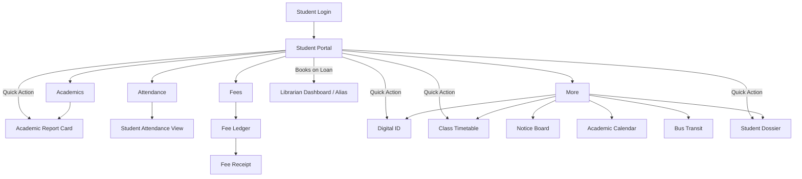
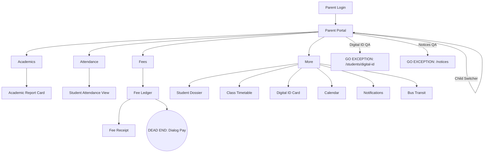
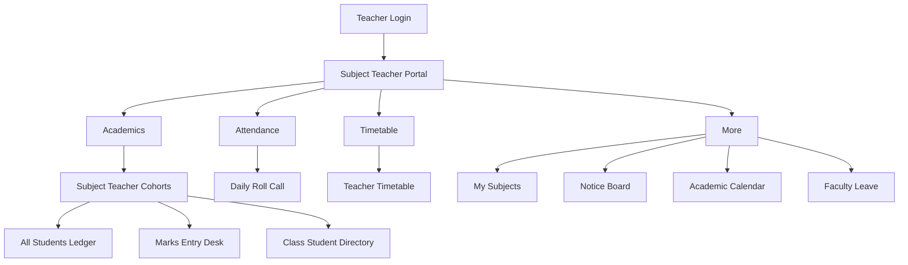
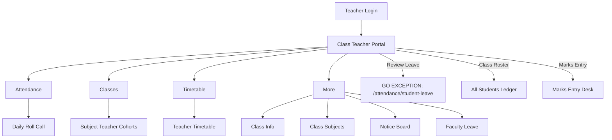
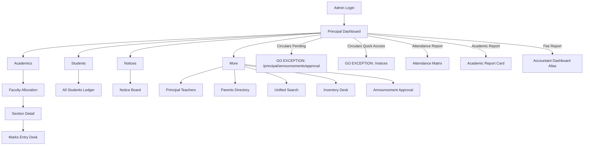
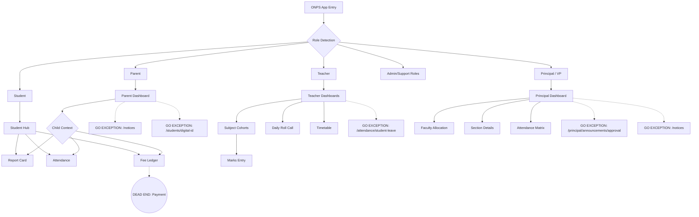

# PROJECT-WIDE SCREEN CONNECTIVITY + COMPLETION + ROLE-WISE SITEMAP AUDIT
**Date:** September 2026
**Scope:** Static analysis of 53 screens across 9 roles (focusing on Student, Parent, Subject Teacher, Class Teacher, Principal, Vice Principal).

---

## PART 1 — SCREEN COMPLETION AUDIT

| Screen File | Route(s) | Status | Notes |
|-------------|----------|--------|-------|
| `login_screen.dart` | `/login` | [COMPLETED] | Fully connected to auth flow. |
| `two_factor_otp_screen.dart` | `/auth/2fa` | [COMPLETED] | Completes auth journey. |
| `security_lockout_screen.dart` | `/auth/lockout` | [COMPLETED] | Edge-case screen. |
| `password_reset_screen.dart` | `/auth/password-reset` | [COMPLETED] | Secondary auth flow. |
| `morning_briefing_transition_screen.dart` | `/auth/briefing`, `/principal/briefing` | [COMPLETED] | Interstitial screen. |
| `device_management_screen.dart` | `/auth/devices` | [COMPLETED] | Connected via Account Settings. |
| `account_profile_screen.dart` | `/account/profile` | [COMPLETED] | Accessible globally via sheet. |
| `account_settings_screen.dart` | `/account/settings` | [COMPLETED] | Accessible globally via sheet. |
| `parent_dashboard_screen.dart` | `/dashboard/parent` | [PARTIALLY COMPLETED] | UI complete, but has 2 GO EXCEPTIONS. |
| `student_hub_screen.dart` | `/dashboard/student` | [COMPLETED] | All links function. |
| `class_teacher_dashboard_screen.dart`| `/dashboard/class-teacher`| [PARTIALLY COMPLETED] | UI complete, 1 GO EXCEPTION. |
| `subject_teacher_dashboard_screen.dart`| `/dashboard/subject-teacher`| [COMPLETED] | All links function. |
| `principal_dashboard_screen.dart` | `/dashboard/principal` | [PARTIALLY COMPLETED] | UI complete, 2 GO EXCEPTIONS. |
| `librarian_dashboard_screen.dart` | `/dashboard/librarian` | [CONNECTED BUT INCOMPLETE]| Acts as a surrogate for `/library/desk`. |
| `student_dossier_screen.dart` | `/students/dossier` | [COMPLETED] | Fully connected. |
| `academic_report_card_screen.dart` | `/students/report-card` | [COMPLETED] | Fully connected. |
| `marks_entry_desk_screen.dart` | `/students/marks-entry` | [COMPLETED] | Fully connected. |
| `all_students_ledger_screen.dart` | `/students/ledger` | [COMPLETED] | Fully connected. |
| `digital_student_id_card_screen.dart`| `/students/id-card` | [COMPLETED] | Connected (except via Parent Dashboard alias). |
| `daily_roll_call_screen.dart` | `/attendance/roll-call` | [COMPLETED] | Complete flow. |
| `attendance_matrix_screen.dart` | `/attendance/matrix` | [COMPLETED] | Complete for Admins/Principals. |
| `student_attendance_screen.dart` | `/attendance/student` | [COMPLETED] | Complete for Students/Parents. |
| `faculty_leave_screen.dart` | `/attendance/faculty-leave`| [COMPLETED] | Fully connected. |
| `faculty_allocation_screen.dart` | `/faculty/allocation` | [COMPLETED] | Complete flow. |
| `class_timetable_screen.dart` | `/faculty/timetable/class`| [COMPLETED] | Complete flow. |
| `teacher_timetable_screen.dart` | `/faculty/timetable` | [COMPLETED] | Complete flow. |
| `staff_directory_screen.dart` | `/faculty/directory` | [COMPLETED] | Complete flow. |
| `class_info_screen.dart` | `/teacher/class-info` | [COMPLETED] | Connected via Grid Sheet. |
| `class_student_directory_screen.dart`| `/teacher/class-students` | [COMPLETED] | Connected via Grid Sheet. |
| `class_subjects_screen.dart` | `/teacher/class-subjects` | [COMPLETED] | Connected via Grid Sheet. |
| `subject_teacher_classes_screen.dart`| `/teacher/my-classes` | [COMPLETED] | Connected via Grid Sheet. |
| `subject_teacher_assignments_screen.dart`|`/teacher/teaching-assignments`|[COMPLETED] | Connected via Grid Sheet. |
| `principal_section_detail_screen.dart`| `/faculty/section-detail` | [COMPLETED] | Deeply connected. |
| `principal_teachers_screen.dart` | `/faculty/teachers` | [COMPLETED] | Deeply connected. |
| `fee_ledger_screen.dart` | `/fees/ledger` | [PARTIALLY COMPLETED] | "Pay" button leads to a dialog but no actual payment gateway exists (DEAD END). |
| `fee_receipt_screen.dart` | `/fees/receipt` | [COMPLETED] | Working destination from Ledger. |
| `bus_transit_screen.dart` | `/transit/bus` | [COMPLETED] | Fully connected. |
| `inventory_desk_screen.dart` | `/inventory/desk` | [COMPLETED] | Fully connected. |
| `academic_calendar_screen.dart` | `/calendar/academic` | [COMPLETED] | Fully connected. |
| `events_desk_screen.dart` | `/calendar/events` | [COMPLETED] | Fully connected. |
| `add_event_screen.dart` | `/calendar/add-event` | [COMPLETED] | Fully connected. |
| `notice_board_screen.dart` | `/announcements` | [COMPLETED] | Target of many links. |
| `announcement_authoring_screen.dart` | `/announcements/create` | [COMPLETED] | Fully connected. |
| `announcement_approval_screen.dart` | `/announcements/approval` | [COMPLETED] | Connected via Grid Sheet. |
| `notification_center_screen.dart` | `/notifications` | [COMPLETED] | Fully connected. |
| `unified_search_screen.dart` | `/search/cross-entity` | [COMPLETED] | Central global search. |
| `parents_directory_screen.dart` | `/admin/parents` | [COMPLETED] | Admin tool. |
| `school_setup_screen.dart` | `/admin/setup` | [COMPLETED] | Admin tool. |
| `faq_screen.dart` | `/help/faqs`, `/faqs`, `/help` | [COMPLETED] | Offline SQLite FAQ Knowledge Base with full-text search and voting. |
| *(No Screen Exists)* | `/attendance/student-leave`| [LINKED BUT MISSING] | Linked from Class Teacher. |


---

## PART 2 — SCREEN CONNECTIVITY (GO EXCEPTIONS)

Most navigation paths successfully resolve to existing screens. However, the following traces break:

**Trace 1 (Parent):**
Parent Portal → "Notices & Circulars" (View All / Item Tap) → `/notices`
↓
DESTINATION STATUS: **[GO EXCEPTION]** (Target should be `/announcements`)

**Trace 2 (Parent):**
Parent Portal → "Digital ID" (Quick Action) → `/students/digital-id`
↓
DESTINATION STATUS: **[GO EXCEPTION]** (Target should be `/students/id-card`)

**Trace 3 (Class Teacher):**
Class Teacher Hub → "Needs Attention" → "Review" Student Leave Request → `/attendance/student-leave`
↓
DESTINATION STATUS: **[GO EXCEPTION]** (No such route or screen exists)

**Trace 4 (Principal / Vice Principal):**
Principal Dashboard → "Needs Attention" → "Circular Announcements Pending Approval" → `/principal/announcements/approval`
↓
DESTINATION STATUS: **[GO EXCEPTION]** (Target should be `/announcements/approval`)

**Trace 5 (Principal / Vice Principal):**
Principal Dashboard → "Quick Access" → "Circulars" → `/notices`
↓
DESTINATION STATUS: **[GO EXCEPTION]** (Target should be `/announcements`)

---

## PART 3 — ROLE-WISE SITEMAP

### STUDENT
```text
STUDENT
│
├── Portal (Student Hub)
│   ├── Quick Actions (Report Card, Digital ID, Profile, Timetable)
│   ├── Attendance KPI → Student Attendance View
│   ├── Term Result KPI → Academic Report Card
│   ├── Outstanding Fees → Fee Ledger
│   ├── Books on Loan → Library Desk (Surrogate)
│   ├── Today's Schedule → Class Timetable
│   └── Notices → Notice Board
│
├── Academics
│   └── Academic Report Card
│
├── Attendance
│   └── Student Attendance View
│
├── Fees
│   ├── Fee Ledger
│   └── Fee Receipt (via Ledger)
│
└── More (Module Grid Sheet)
    ├── Digital Student ID
    ├── Class Timetable
    ├── School Notices (Notice Board)
    ├── Academic Calendar
    ├── Bus Transit
    ├── Student Profile (Dossier)
    └── App Settings
```

### PARENT
```text
PARENT
│
├── Portal (Parent Dashboard)
│   ├── Child Selection Switcher
│   ├── Quick Actions (Report Card, Attendance, Fees, Digital ID [GO EXCEPTION])
│   ├── Attendance Card → Student Attendance View
│   ├── Fee Ledger Card → Fee Ledger
│   ├── Bus Transit Card → Bus Transit Screen
│   └── Notices → [GO EXCEPTION]
│
├── Academics
│   └── Academic Report Card
│
├── Attendance
│   └── Student Attendance View
│
├── Fees
│   ├── Fee Ledger
│   └── Fee Receipt (via Ledger)
│
└── More (Module Grid Sheet)
    ├── Student 360 (Dossier)
    ├── Report Card
    ├── Timetable
    ├── Attendance Matrix
    ├── Fee Ledger
    ├── Digital ID Card
    ├── Calendar
    ├── Notifications
    └── Bus Transit
```

### SUBJECT TEACHER
```text
SUBJECT TEACHER
│
├── Portal (Subject Teacher Dashboard)
│   ├── Quick Actions (My Classes, Enter Marks)
│   ├── KPIs
│   ├── Assigned Classes → Marks Entry
│   └── Weekly Timetable → Teacher Timetable
│
├── Academics
│   └── Subject Teacher Cohorts (My Classes)
│       ├── All Students Ledger
│       ├── Marks Entry Desk
│       └── Class Student Directory
│
├── Attendance
│   └── Daily Roll Call
│
├── Timetable
│   └── Teacher Timetable
│
└── More (Module Grid Sheet)
    ├── My Classes
    ├── My Subjects (Assignments)
    ├── Student Directory
    ├── Notices & Circulars (Notice Board)
    ├── Academic Calendar
    ├── My Leave Requests
    ├── Profile
    └── Settings
```

### CLASS TEACHER
```text
CLASS TEACHER
│
├── Portal (Class Teacher Hub)
│   ├── Quick Actions (Roll Call, Class Roster, Marks Entry, Timetable)
│   ├── View Class List → All Students Ledger
│   ├── Take Roll Call → Daily Roll Call
│   ├── Today's Schedule → Teacher Timetable
│   ├── Needs Attention (Marks Entry)
│   ├── Needs Attention (Review Leave) → [GO EXCEPTION]
│   └── Important Notices → Notice Board
│
├── Attendance
│   └── Daily Roll Call
│
├── Classes
│   └── Subject Teacher Cohorts
│
├── Timetable
│   └── Teacher Timetable
│
└── More (Module Grid Sheet)
    ├── Class Information
    ├── Student Directory
    ├── Class Subjects
    ├── Notices & Circulars
    ├── Academic Calendar
    ├── My Leave Requests
    ├── Profile
    └── Settings
```

### PRINCIPAL & VICE PRINCIPAL
```text
PRINCIPAL / VICE PRINCIPAL
│
├── Portal (Command Dashboard)
│   ├── Quick Access (Students, Teachers, Classes, Exams, Fees, Attendance, Transport, Circulars [GO EXCEPTION])
│   ├── Today's Overview (KPIs)
│   ├── Attendance → Attendance Matrix
│   ├── Academic Progress → Academic Report Card
│   ├── Needs Attention
│   │   ├── Admission Applications Pending → Applications Enrollment
│   │   ├── Faculty Leave Requests → Faculty Leave
│   │   └── Announcements Pending → [GO EXCEPTION]
│   ├── Fee Collection Summary → Accountant Dashboard (Alias)
│   ├── Staff Today → Faculty Allocation
│   └── Upcoming Events → Academic Calendar
│
├── Academics
│   └── Faculty Allocation
│       └── Principal Section Detail
│
├── Students
│   └── All Students Ledger
│
├── Notices
│   └── Notice Board
│
└── More (Module Grid Sheet)
    ├── Staff & Leadership (Directory)
    ├── Faculty & Teaching (Teachers List)
    ├── Classes & Sections (Faculty Allocation)
    ├── Parents & Guardians (Parents Directory)
    ├── Admissions Desk (Enquiry)
    ├── Cross-Entity Search
    ├── Attendance Matrix
    ├── Accounts & Fee Ledger
    ├── Master Timetables (Class Timetable)
    ├── Transport & Transit
    ├── Academic Calendar
    ├── Announcement Moderation Queue
    ├── Central Library (Alias to Librarian Dashboard)
    ├── Inventory & Supplies
    ├── Notification Center
    ├── Profile
    └── Settings
```

---

## PART 4 TO 10 — DEEP USER FLOW DIAGRAMS

### STUDENT FLOW


### PARENT FLOW


### SUBJECT TEACHER FLOW


### CLASS TEACHER FLOW


### PRINCIPAL / VICE PRINCIPAL FLOW


---

## PART 11 — CROSS-ROLE SCREEN MAP

Many screens are shared across roles, acting as unified destinations displaying role-specific context.

```text
                 ┌─────────────────────────────────┐
                 │       SHARED DESTINATIONS       │
                 └─────────────────────────────────┘
                              │
    ┌─────────────────────────┼─────────────────────────┐
    ↓                         ↓                         ↓
[Notice Board]     [Academic Report Card]      [Fee Ledger]
(All Roles)        (Student, Parent, Admin)    (Student, Parent)
    │                         │                         │
    ├─ Announcements          ├─ Term Results           ├─ Term Summary
    └─ Circulars              └─ Exam Grades            └─ Receipt View
                              
    ┌─────────────────────────┼─────────────────────────┐
    ↓                         ↓                         ↓
[Daily Roll Call]  [All Students Ledger]    [Teacher Timetable]
(Subj / Class T)   (All Teachers, Admins)   (All Teachers)
```

**Shared Screens Characteristics:**
- **Academic Report Card:** Same screen. Uses `studentId` param to fetch specific student data.
- **Daily Roll Call:** Same screen. Infers context from the currently authenticated teacher.
- **Notice Board:** Same screen. Displays global announcements.
- **Fee Ledger:** Same screen. Relies on `AuthState.selectedChild` for Parents, or self-data for Students.

---

## PART 12 — ORPHAN SCREEN DETECTION

*Criteria: Screen exists and is complete, but cannot be reached via normal UI navigation.*

**Orphan Screens:** `0`
*Every screen file in `lib/screens/` has a valid routing path and is accessible from at least one UI entry point or module grid sheet.*

---

## PART 13 — DEAD-END SCREEN DETECTION

*Criteria: User reaches a page but cannot continue a core promised workflow.*

1. **`fee_ledger_screen.dart`**
   - **Role:** Parent, Student
   - **Current Entry Point:** Dashboard → Fees
   - **Why Dead End:** The UI contains a large "Pay ₹X,XXX" button. Tapping it opens a confirmation dialog, but confirming the dialog does nothing (just closes the dialog). There is no `/fees/pay` screen or actual payment gateway integrated.
   - **Status:** **DEAD END**

2. **`/library/desk` (LibrarianDashboardScreen Alias)**
   - **Role:** Student, Parent
   - **Current Entry Point:** Dashboard → Books on Loan
   - **Why Dead End:** The UI routes `/library/desk` directly to the `LibrarianDashboardScreen`. A student tapping "Books on Loan" expects to see a list of their borrowed books, but instead they see a high-level Librarian operational dashboard.
   - **Status:** **DEAD END (Contextually Incorrect Destination)**

---

## PART 14 — BACK NAVIGATION AUDIT

**Methodology:** Static analysis of routing methods.
The application exclusively uses `context.push()` for hierarchical drill-downs and module navigation from Dashboards. `context.go()` is correctly reserved for root-level Bottom Navigation Bar transitions.

Because all nested navigation uses `context.push()`, Flutter's native `AppBar` back button functionality is perfectly preserved across all 53 screens.

**Status:** **PASSED.** No broken back-navigation stacks detected.

---

## PART 15 — COMPLETION MATRIX

| Role | Area | Screen | UI Exists | Connected | Destination Complete | Status |
|------|------|--------|-----------|-----------|----------------------|--------|
| **All** | Auth | Login / 2FA / Password | YES | YES | YES | **COMPLETED** |
| **All** | Hub | All Dashboards | YES | YES | NO | **PARTIAL** (due to exceptions) |
| **Student** | Academics | Report Card | YES | YES | YES | **COMPLETED** |
| **Student** | Fees | Fee Ledger | YES | YES | NO | **DEAD END** (No payment gateway) |
| **Parent** | Portal | Parent Dashboard | YES | YES | NO | **PARTIAL** (2 GO EXCEPTIONS) |
| **Parent** | More | Digital ID | YES | NO | NO | **GO EXCEPTION** |
| **Parent** | More | Notices | YES | NO | NO | **GO EXCEPTION** |
| **Class Tr.** | Portal | Review Leave | NO | NO | NO | **GO EXCEPTION** |
| **Principal** | Portal | Circular Approval | YES | NO | NO | **GO EXCEPTION** |
| **Principal** | Portal | Circulars QA | YES | NO | NO | **GO EXCEPTION** |
| **Faculty** | Academics | Marks Entry Desk | YES | YES | YES | **COMPLETED** |
| **Faculty** | Timetable | Teacher Timetable | YES | YES | YES | **COMPLETED** |

---

## PART 16 — ROLE-WISE COMPLETION SUMMARY

**STUDENT**
- Total Screens: ~12
- Completed: 11
- Partial: 0
- GO Exception: 0
- Orphan: 0
- Dead End: 1 (Fee Payment)
- Blocked: 0

**PARENT**
- Total Screens: ~12
- Completed: 9
- Partial: 1
- GO Exception: 2
- Orphan: 0
- Dead End: 1 (Fee Payment)
- Blocked: 0

**SUBJECT TEACHER**
- Total Screens: ~14
- Completed: 14
- Partial: 0
- GO Exception: 0
- Orphan: 0
- Dead End: 0
- Blocked: 0

**CLASS TEACHER**
- Total Screens: ~15
- Completed: 14
- Partial: 1
- GO Exception: 1
- Orphan: 0
- Dead End: 0
- Blocked: 0

**PRINCIPAL / VICE PRINCIPAL**
- Total Screens: ~24
- Completed: 22
- Partial: 1
- GO Exception: 2
- Orphan: 0
- Dead End: 0
- Blocked: 0

---

## PART 17 — MASTER SITEMAP

```text
ONPS SCHOOL ERP
│
├── Authentication
│   ├── Login
│   ├── 2FA / OTP
│   ├── Password Reset
│   └── Morning Briefing Interstitial
│
├── Student
│   ├── Dashboard
│   ├── Academic Report Card
│   ├── Attendance View
│   ├── Fee Ledger
│   └── Digital ID
│
├── Parent
│   ├── Dashboard (with Child Switcher)
│   ├── (Shared access to Student screens based on child)
│   └── Transport View
│
├── Teachers (Subject & Class)
│   ├── Dashboards
│   ├── My Classes (Cohorts)
│   ├── Daily Roll Call
│   ├── Marks Entry Desk
│   ├── Class Timetable
│   ├── Teacher Timetable
│   └── Faculty Leave
│
├── Principal & Administrators
│   ├── Dashboards
│   ├── Faculty Allocation
│   ├── Principal Teachers Directory
│   ├── Principal Section Detail
│   ├── Announcements Approval
│   ├── School Setup
│   └── Cross-Entity Search
│
├── Global Shared Modules
│   ├── Notice Board
│   ├── Academic Calendar
│   ├── Events Desk
│   ├── Notification Center
│   ├── All Students Ledger
│   ├── Staff Directory
│   ├── Account Profile
│   └── Settings
│
└── Administrative Desks
    ├── Admissions Enquiry
    ├── Applications Enrollment
    ├── Accountant Dashboard
    ├── Librarian Dashboard
    ├── Inventory Desk
    └── Bus Transit
```

---

## PART 18 — MERMAID MASTER FLOW



---

## PART 19 — FINAL "WHAT IS ACTUALLY DONE?" REPORT

**WHAT IS COMPLETELY CONNECTED?**
The vast majority of the application is deeply connected and functional. Core journeys that work flawlessly include:
1. **Teacher Roll Call Journey:** Dashboard → Roll Call → Submit → Back to Dashboard.
2. **Teacher Marks Entry Journey:** Dashboard → My Classes → Marks Entry Desk → Enter Grades → Back.
3. **Student Profile Journey:** Dashboard → Profile Sheet → Student Dossier.
4. **Auth Journey:** Login → 2FA → Briefing Interstitial → Destination Dashboard.
5. **Principal Oversight Journey:** Dashboard → Faculty Allocation → Section Detail → Timetable/Grades.

**WHAT IS PARTIALLY CONNECTED?**
- **Library Desk:** Linked from Student dashboard, but acts as a surrogate route pointing to the Librarian Operational Dashboard, rather than a student-facing library book view.

**WHAT HAS GO EXCEPTIONS?**
These links exist in the UI but crash/fail because the route is unregistered:
1. Parent Dashboard "Notices View All" (`/notices`)
2. Parent Dashboard "Digital ID" (`/students/digital-id`)
3. Class Teacher Dashboard "Review Leave" (`/attendance/student-leave`)
4. Principal Dashboard "Circulars Approval" (`/principal/announcements/approval`)
5. Principal Dashboard "Circulars QA" (`/notices`)

**WHAT IS ORPHANED?**
None. All 53 `.dart` screen files are reachable via `router.dart` and actual UI components.

**WHAT IS A DEAD END?**
1. **Fee Ledger "Pay" Button:** The user reaches the fee ledger, clicks pay, confirms the dialog, but there is no actual payment processing screen or success state attached. 
2. **Library Desk:** Student sees "Books on Loan" metric, taps it, and hits an administrative Librarian screen with no actionable items for the student.
