# ONPS ERP — Offline-First SQLite Architecture Plan

**Goal:** Fastest and most consistent school ERP on Android
**Strategy:** Local SQLite becomes the single source of truth the UI reads from. The network fills SQLite in the background. The UI never waits on the network.

| | |
|---|---|
| **Status** | PROPOSAL — not yet implemented |
| **Baseline commit** | `0c27193` |
| **App** | Flutter, 42k LOC, 56 screens, 9 roles, 32 endpoints, 34 models |
| **Backend** | Django REST @ `alpha.onenuman.com/api/v1` (source not in this repo) |
| **Estimated effort** | 7–9 weeks across 7 phases |

---

## 0. The Core Idea

Your instinct — *"SQLite for older data, backend for heavy load"* — is directionally right. The correction: the win does not come from caching *old* data. It comes from **inverting the data flow**.

### Today — pull-through (network on the critical path)

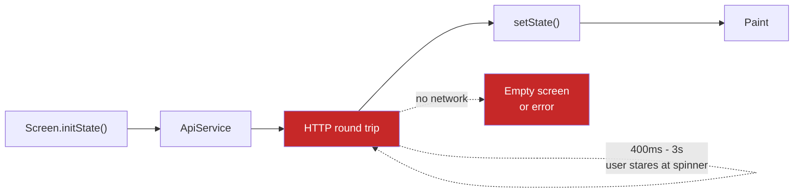

Every screen open = a network round trip. No network = no screen.

### Target — local-first (network fully decoupled)

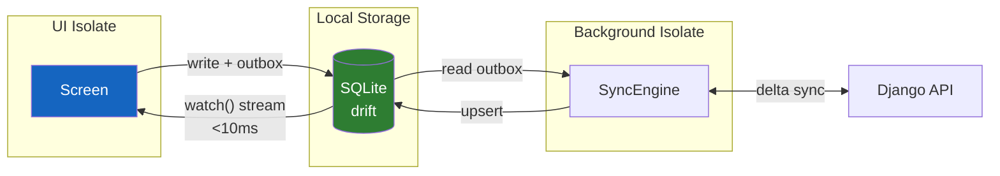

The screen reads SQLite and paints in **under 10ms**. The sync engine independently refreshes SQLite; when rows change, `watch()` re-emits and the UI updates itself. **Network latency is decoupled from perceived performance.**

> **Key reframe:** don't classify data by *age*. Classify by **volatility and ownership**. A timetable is a year old and must be cached. A fee-collection total is 5 seconds old and must never be treated as truth.

---

## 1. Full System Architecture

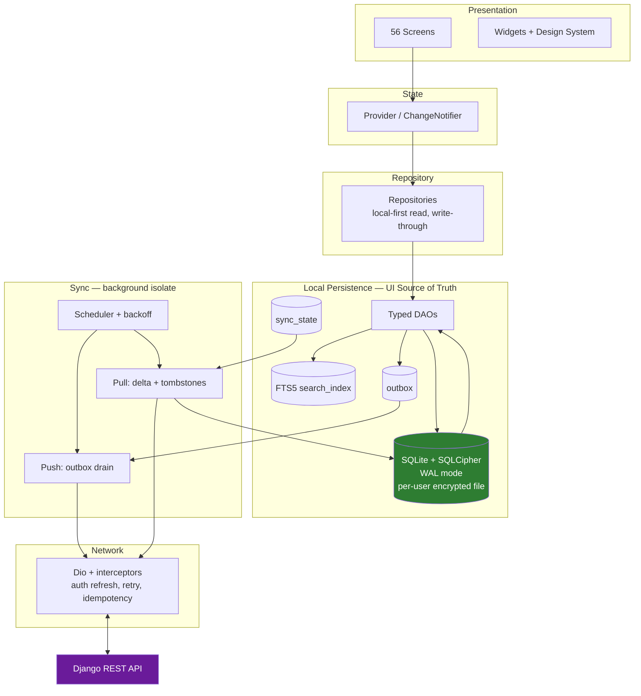

---

## 2. Hard Blockers — fix before any SQLite work

Each of these structurally prevents offline-first from working.

| # | Blocker | Location | Why it blocks |
|---|---|---|---|
| **B1** | No session restore on cold start | `splash_screen.dart:143-149` | Splash does `context.go('/')` after a 4s timer, no `getToken()`. `_isAuthenticated` starts `false` → router bounces to `/login`. **An offline user can never get past login**, no matter how much data is cached. |
| **B2** | ApiClient hard-throws in every test | `api_client.dart:81-85` | `if (isFlutterTest) throw NetworkException(...)` fires before the request. A sync engine cannot be tested while this exists. |
| **B3** | Tokens in plaintext SharedPreferences | `token_storage.dart:1` | Once SQLite holds student PII, marks and fees on-device, a plaintext JWT beside it is unacceptable. |
| **B4** | `switchRole()` grants auth client-side | `auth_state.dart:203-207` | Sets `_isAuthenticated = true` with no server call. With a local cache this becomes a real data-leak path. 4 production call sites. |
| **B5** | No role guard in router | `router.dart:93-106` | Only checks `isAuthenticated`, never role. Offline there is no backend — so **no isolation at all**. |
| **B6** | 49 `contains('Test')` branches in 38 files | `lib/` | Mock data lives inside production files behind a runtime string sniff. Must be deleted, not migrated. |

### B1 — the cold-start flow that must exist

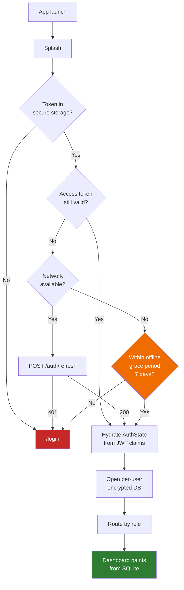

---

## 3. Technology Decisions

### 3.1 Persistence: migrate `sqflite` → `drift`

| Requirement | `sqflite` today | `drift` |
|---|---|---|
| Reactive UI on row change | Hand-roll streams across 56 screens | `watch()` — the basis of this architecture |
| Type safety | `Map<String,dynamic>` casts | Generated typed rows, compile-checked SQL |
| Testability | Needs a device; **DB layer has zero tests today** | Runs in plain `dart test` via `NativeDatabase.memory()` |
| Migrations | Hand-written `onUpgrade` — **currently dead code** | Versioned strategy + schema snapshot tests |
| Background isolate | Manual | `NativeDatabase.createInBackground()` |

`drift` sits on `sqlite3` FFI — it **is** SQLite3, with a better Dart surface.

**Bundle the engine:** add `sqlite3_flutter_libs`. Android's system SQLite varies by OEM/OS and **FTS5 is not guaranteed present**. Bundling pins one modern SQLite on every device — a direct consistency win and a prerequisite for §8.3.

### 3.2 Package changes

| Package | Replaces / adds | Why |
|---|---|---|
| `drift`, `drift_flutter`, `sqlite3_flutter_libs` | `sqflite` | §3.1 |
| `sqlcipher_flutter_libs` | — | Encrypt at rest. Student PII ⇒ India DPDP Act 2023 |
| `flutter_secure_storage` | prefs for tokens | Fixes **B3** |
| `dio` | `http` | Interceptors: auth refresh, retry, gzip, `Idempotency-Key` |
| `connectivity_plus` | — | Drive offline UI + sync triggers |
| `workmanager` | — | Android periodic background sync |
| `uuid` | — | Client IDs + idempotency keys |

**Keeping `provider`.** A state-management migration on top of a persistence migration doubles blast radius for little gain. The data layer determines speed here.

### 3.3 Two live FAQ-DB defects to carry over correctly

1. **`_onUpgrade` is dead code.** `faq_database.dart:68` guards `if (oldVersion < 2)`, but the file was born at version 2 in the first commit. Bump to v3 tomorrow → `2 < 2` is false → **the content update silently does nothing for every existing user.** Must be `oldVersion < newVersion`.
2. **`idx_faqs_target_roles`** (`faq_database.dart:57`) can never be used — the query is `LIKE '%role%'` and SQLite cannot use an index with a leading wildcard. Drop it; normalize into a junction table.

---

## 4. Data Tiering

### 4.1 Classification decision tree

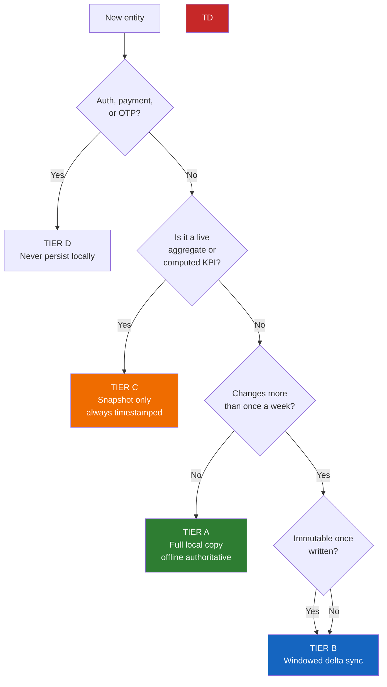

### 4.2 The four tiers

| Tier | Entities | Sync | UI contract |
|---|---|---|---|
| **A — Reference** | classes, sections, subjects, staff, timetables, fee structure, holidays, calendar, routes, FAQs, school config | Launch + 24h, ETag-gated → usually `304` | Instant, offline, **no staleness warning** |
| **B — History** | attendance, marks, report cards, fee payments, receipts, book issues, announcements, leave requests | Delta by `updated_at` watermark; rolling window = session + 90 days | Instant from cache + `Updated 4m ago` + pull-to-refresh |
| **C — Live aggregates** | all 8 dashboards, today's attendance %, collection totals, bus GPS | Screen open + refresh, TTL 60–120s | Paint cached snapshot **with `as of HH:mm`**, then refresh in place |
| **D — Never local** | tokens, OTP, payment sessions, password reset | — | Online-only |

**Volume note:** 1,240 students × ~200 school days ≈ **250k attendance rows/session** for a principal. Nothing for SQLite with correct indexes — but very expensive over HTTP, which is exactly why it must be cached.

### 4.3 The 32 current endpoints, tiered

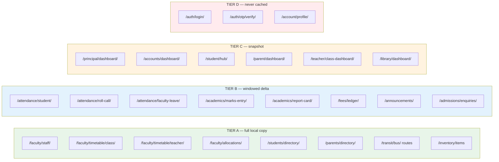

---

## 5. Local Schema

### 5.1 Entity relationships

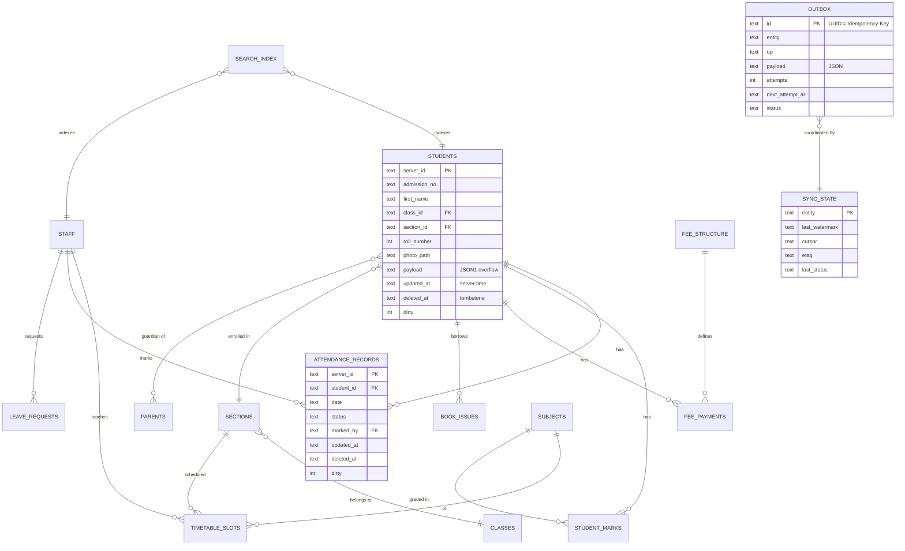

### 5.2 Universal sync columns

Every synced table carries these — the sync engine depends on them.

```sql
server_id     TEXT    NOT NULL,           -- backend PK, never the local rowid
updated_at    TEXT    NOT NULL,           -- ISO8601 UTC, FROM THE SERVER
deleted_at    TEXT,                       -- soft-delete tombstone; NULL = live
synced_at     TEXT    NOT NULL,           -- when this device last wrote it
dirty         INTEGER NOT NULL DEFAULT 0  -- 1 = local unsynced edit pending
```

### 5.3 Bootstrap PRAGMAs

```sql
PRAGMA journal_mode = WAL;        -- readers never block on the sync writer. Essential.
PRAGMA synchronous  = NORMAL;     -- WAL-safe, ~10x faster than FULL
PRAGMA foreign_keys = ON;         -- OFF by default in SQLite - silent corruption source
PRAGMA temp_store   = MEMORY;
PRAGMA cache_size   = -8000;      -- 8 MB page cache
PRAGMA mmap_size    = 268435456;  -- 256 MB memory-mapped I/O
PRAGMA busy_timeout = 5000;
```

**WAL is the important one** — it lets a screen read while the sync engine writes. Without it, background sync visibly stalls scrolling.

### 5.4 Schema conventions — apply to every table

| Rule | Value | Why |
|---|---|---|
| Primary key | `server_id TEXT` | Backend PK. Never SQLite `rowid` — it is device-local and meaningless across devices |
| Timestamps | `TEXT`, ISO8601 UTC, `2026-09-24T10:05:31Z` | Sorts lexicographically = sorts chronologically. No timezone ambiguity |
| Booleans | `INTEGER` 0/1 | SQLite has no boolean type |
| **Money** | `INTEGER` **paise**, never `REAL` | `REAL` cannot represent ₹0.10 exactly. Accumulating float over 250k fee rows produces wrong totals. Store `844537790` = ₹84,45,377.90 |
| Enums | `TEXT` + `CHECK` constraint | Self-documenting, matches Django `choices` |
| Rare fields | `payload TEXT` JSON1 | Avoids 60-column tables; queried via `json_extract()` when genuinely needed |
| Images | `photo_path TEXT` | Disk path. **Never blobs** — they destroy page-cache locality |
| Tombstones | `deleted_at TEXT NULL` | Soft delete. Partial indexes use `WHERE deleted_at IS NULL` |

### 5.5 Domain map

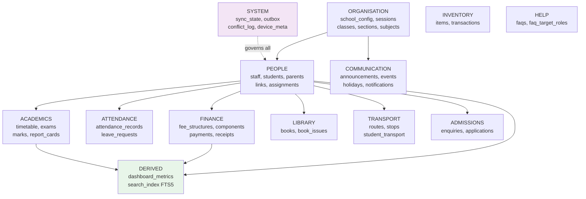

---

### 5.6 System tables

```sql
-- Per-entity sync bookkeeping. One row per syncable entity.
CREATE TABLE sync_state (
  entity          TEXT PRIMARY KEY,             -- 'students', 'attendance_records', ...
  tier            TEXT NOT NULL CHECK (tier IN ('A','B','C')),
  last_watermark  TEXT,                         -- meta.server_time of last COMPLETE sync
  cursor          TEXT,                         -- in-flight keyset cursor; NULL when complete
  etag            TEXT,                         -- Tier A only
  last_run_at     TEXT,
  last_status     TEXT CHECK (last_status IN ('ok','partial','error')),
  last_error      TEXT,
  row_count       INTEGER NOT NULL DEFAULT 0
);

-- Offline write queue. id doubles as the Idempotency-Key.
CREATE TABLE outbox (
  id              TEXT PRIMARY KEY,             -- client UUID v4
  entity          TEXT NOT NULL,
  entity_id       TEXT NOT NULL,                -- server_id of the affected row
  op              TEXT NOT NULL CHECK (op IN ('create','update','delete')),
  endpoint        TEXT NOT NULL,                -- e.g. '/attendance/roll-call/'
  method          TEXT NOT NULL CHECK (method IN ('POST','PUT','PATCH','DELETE')),
  payload         TEXT NOT NULL,                -- JSON request body
  created_at      TEXT NOT NULL,
  attempts        INTEGER NOT NULL DEFAULT 0,
  next_attempt_at TEXT,
  last_error      TEXT,
  http_status     INTEGER,
  status          TEXT NOT NULL DEFAULT 'pending'
                  CHECK (status IN ('pending','inflight','failed','conflict')),
  depends_on      TEXT REFERENCES outbox(id)    -- ordering for dependent writes
);
CREATE INDEX idx_outbox_ready   ON outbox(status, next_attempt_at);
CREATE INDEX idx_outbox_entity  ON outbox(entity, entity_id);

-- Unresolved conflicts awaiting user decision.
CREATE TABLE conflict_log (
  id            TEXT PRIMARY KEY,
  outbox_id     TEXT NOT NULL REFERENCES outbox(id) ON DELETE CASCADE,
  entity        TEXT NOT NULL,
  entity_id     TEXT NOT NULL,
  local_payload  TEXT NOT NULL,                 -- what the user did
  server_payload TEXT NOT NULL,                 -- what the server holds
  detected_at   TEXT NOT NULL,
  resolved_at   TEXT,
  resolution    TEXT CHECK (resolution IN ('keep_local','take_server','merged'))
);
CREATE INDEX idx_conflict_open ON conflict_log(resolved_at) WHERE resolved_at IS NULL;

-- Single-row table binding this DB file to one user. Guards against file reuse.
CREATE TABLE device_meta (
  id              INTEGER PRIMARY KEY CHECK (id = 1),
  user_id         TEXT NOT NULL,
  school_id       TEXT NOT NULL,
  role            TEXT NOT NULL,
  schema_version  INTEGER NOT NULL,
  db_created_at   TEXT NOT NULL,
  last_online_at  TEXT NOT NULL,                -- drives the 7-day offline grace period
  cold_sync_done  INTEGER NOT NULL DEFAULT 0
);
```

### 5.7 Organisation

```sql
CREATE TABLE school_config (
  server_id   TEXT PRIMARY KEY,
  name        TEXT NOT NULL,
  abbr        TEXT,
  affiliation TEXT,
  address     TEXT,
  support_email TEXT,
  logo_path   TEXT,
  payload     TEXT,
  updated_at TEXT NOT NULL, deleted_at TEXT, synced_at TEXT NOT NULL,
  dirty INTEGER NOT NULL DEFAULT 0
);

CREATE TABLE academic_sessions (
  server_id  TEXT PRIMARY KEY,
  name       TEXT NOT NULL,                     -- '2026-27'
  start_date TEXT NOT NULL,
  end_date   TEXT NOT NULL,
  is_active  INTEGER NOT NULL DEFAULT 0,
  updated_at TEXT NOT NULL, deleted_at TEXT, synced_at TEXT NOT NULL,
  dirty INTEGER NOT NULL DEFAULT 0
);
CREATE INDEX idx_session_active ON academic_sessions(is_active) WHERE is_active = 1;

CREATE TABLE classes (
  server_id  TEXT PRIMARY KEY,
  grade      TEXT NOT NULL,                     -- 'NUR','LKG','1'..'12'
  name       TEXT NOT NULL,
  sort_order INTEGER NOT NULL DEFAULT 0,        -- NUR < LKG < 1 — never sort alphabetically
  session_id TEXT REFERENCES academic_sessions(server_id),
  updated_at TEXT NOT NULL, deleted_at TEXT, synced_at TEXT NOT NULL,
  dirty INTEGER NOT NULL DEFAULT 0
);
CREATE INDEX idx_classes_order ON classes(sort_order) WHERE deleted_at IS NULL;

CREATE TABLE sections (
  server_id        TEXT PRIMARY KEY,
  class_id         TEXT NOT NULL REFERENCES classes(server_id),
  name             TEXT NOT NULL,               -- 'A','B','C'
  display_name     TEXT,                        -- '5-A'
  class_teacher_id TEXT REFERENCES staff(server_id),
  room_number      TEXT,
  capacity         INTEGER,
  student_count    INTEGER NOT NULL DEFAULT 0,  -- denormalised, maintained by trigger
  updated_at TEXT NOT NULL, deleted_at TEXT, synced_at TEXT NOT NULL,
  dirty INTEGER NOT NULL DEFAULT 0,
  UNIQUE(class_id, name)
);
CREATE INDEX idx_sections_class    ON sections(class_id) WHERE deleted_at IS NULL;
CREATE INDEX idx_sections_teacher  ON sections(class_teacher_id);

CREATE TABLE subjects (
  server_id  TEXT PRIMARY KEY,
  code       TEXT NOT NULL,
  name       TEXT NOT NULL,
  department TEXT,
  is_elective INTEGER NOT NULL DEFAULT 0,
  max_marks  INTEGER,
  updated_at TEXT NOT NULL, deleted_at TEXT, synced_at TEXT NOT NULL,
  dirty INTEGER NOT NULL DEFAULT 0
);
CREATE UNIQUE INDEX idx_subjects_code ON subjects(code) WHERE deleted_at IS NULL;

CREATE TABLE class_subjects (                   -- which subjects a class studies
  server_id  TEXT PRIMARY KEY,
  class_id   TEXT NOT NULL REFERENCES classes(server_id),
  subject_id TEXT NOT NULL REFERENCES subjects(server_id),
  updated_at TEXT NOT NULL, deleted_at TEXT, synced_at TEXT NOT NULL,
  dirty INTEGER NOT NULL DEFAULT 0,
  UNIQUE(class_id, subject_id)
);
```

### 5.8 People

```sql
CREATE TABLE staff (
  server_id     TEXT PRIMARY KEY,
  employee_code TEXT NOT NULL,
  full_name     TEXT NOT NULL,
  role          TEXT NOT NULL CHECK (role IN
                  ('principal','vicePrincipal','classTeacher','subjectTeacher',
                   'accountant','librarian','receptionist','superAdmin')),
  department    TEXT,
  designation   TEXT,
  email         TEXT,
  mobile        TEXT,
  photo_path    TEXT,
  date_joined   TEXT,
  is_active     INTEGER NOT NULL DEFAULT 1,
  payload       TEXT,
  updated_at TEXT NOT NULL, deleted_at TEXT, synced_at TEXT NOT NULL,
  dirty INTEGER NOT NULL DEFAULT 0
);
CREATE UNIQUE INDEX idx_staff_code ON staff(employee_code) WHERE deleted_at IS NULL;
CREATE INDEX idx_staff_role_name   ON staff(role, full_name) WHERE deleted_at IS NULL;

CREATE TABLE students (
  server_id      TEXT PRIMARY KEY,
  admission_no   TEXT NOT NULL,
  first_name     TEXT NOT NULL,
  last_name      TEXT,
  date_of_birth  TEXT,
  gender         TEXT CHECK (gender IN ('Male','Female','Other')),
  blood_group    TEXT,
  class_id       TEXT REFERENCES classes(server_id),
  section_id     TEXT REFERENCES sections(server_id),
  roll_number    INTEGER,
  admission_date TEXT,
  mobile         TEXT,
  email          TEXT,
  photo_path     TEXT,
  -- address flattened; Address is a value object, not an entity
  addr_line1     TEXT, addr_city TEXT, addr_district TEXT,
  addr_state     TEXT, addr_pincode TEXT, dwelling_type TEXT,
  is_active      INTEGER NOT NULL DEFAULT 1,
  payload        TEXT,
  updated_at TEXT NOT NULL, deleted_at TEXT, synced_at TEXT NOT NULL,
  dirty INTEGER NOT NULL DEFAULT 0
);
CREATE UNIQUE INDEX idx_students_adm  ON students(admission_no) WHERE deleted_at IS NULL;
CREATE INDEX idx_students_roster      ON students(class_id, section_id, roll_number)
  WHERE deleted_at IS NULL;                     -- the roster query — must be SEARCH not SCAN
CREATE INDEX idx_students_name        ON students(first_name, last_name)
  WHERE deleted_at IS NULL;

CREATE TABLE parents (
  server_id  TEXT PRIMARY KEY,
  full_name  TEXT NOT NULL,
  relation   TEXT CHECK (relation IN ('father','mother','guardian')),
  mobile     TEXT, email TEXT, occupation TEXT, photo_path TEXT,
  payload    TEXT,
  updated_at TEXT NOT NULL, deleted_at TEXT, synced_at TEXT NOT NULL,
  dirty INTEGER NOT NULL DEFAULT 0
);
CREATE INDEX idx_parents_mobile ON parents(mobile);

CREATE TABLE parent_student_links (             -- many-to-many; multi-child switcher
  server_id  TEXT PRIMARY KEY,
  parent_id  TEXT NOT NULL REFERENCES parents(server_id),
  student_id TEXT NOT NULL REFERENCES students(server_id),
  relation   TEXT CHECK (relation IN ('father','mother','guardian')),
  is_primary INTEGER NOT NULL DEFAULT 0,
  updated_at TEXT NOT NULL, deleted_at TEXT, synced_at TEXT NOT NULL,
  dirty INTEGER NOT NULL DEFAULT 0,
  UNIQUE(parent_id, student_id)
);
CREATE INDEX idx_psl_parent  ON parent_student_links(parent_id);
CREATE INDEX idx_psl_student ON parent_student_links(student_id);

CREATE TABLE teacher_assignments (              -- subject teacher → section → subject
  server_id  TEXT PRIMARY KEY,
  staff_id   TEXT NOT NULL REFERENCES staff(server_id),
  section_id TEXT NOT NULL REFERENCES sections(server_id),
  subject_id TEXT REFERENCES subjects(server_id),
  is_class_teacher INTEGER NOT NULL DEFAULT 0,
  updated_at TEXT NOT NULL, deleted_at TEXT, synced_at TEXT NOT NULL,
  dirty INTEGER NOT NULL DEFAULT 0,
  UNIQUE(staff_id, section_id, subject_id)
);
CREATE INDEX idx_ta_staff   ON teacher_assignments(staff_id) WHERE deleted_at IS NULL;
CREATE INDEX idx_ta_section ON teacher_assignments(section_id) WHERE deleted_at IS NULL;
```

### 5.9 Academics

```sql
CREATE TABLE timetable_slots (
  server_id   TEXT PRIMARY KEY,
  section_id  TEXT NOT NULL REFERENCES sections(server_id),
  subject_id  TEXT REFERENCES subjects(server_id),
  staff_id    TEXT REFERENCES staff(server_id),
  day_of_week INTEGER NOT NULL CHECK (day_of_week BETWEEN 1 AND 7),
  period_no   INTEGER NOT NULL,
  start_time  TEXT NOT NULL,                    -- 'HH:MM'
  end_time    TEXT NOT NULL,
  room_number TEXT,
  updated_at TEXT NOT NULL, deleted_at TEXT, synced_at TEXT NOT NULL,
  dirty INTEGER NOT NULL DEFAULT 0,
  UNIQUE(section_id, day_of_week, period_no)
);
CREATE INDEX idx_tt_section_day ON timetable_slots(section_id, day_of_week, period_no);
CREATE INDEX idx_tt_staff_day   ON timetable_slots(staff_id, day_of_week, period_no);

CREATE TABLE exams (
  server_id  TEXT PRIMARY KEY,
  name       TEXT NOT NULL,                     -- 'Term 1', 'Half Yearly'
  session_id TEXT REFERENCES academic_sessions(server_id),
  start_date TEXT, end_date TEXT,
  is_published INTEGER NOT NULL DEFAULT 0,
  updated_at TEXT NOT NULL, deleted_at TEXT, synced_at TEXT NOT NULL,
  dirty INTEGER NOT NULL DEFAULT 0
);

CREATE TABLE student_marks (
  server_id    TEXT PRIMARY KEY,
  student_id   TEXT NOT NULL REFERENCES students(server_id),
  exam_id      TEXT NOT NULL REFERENCES exams(server_id),
  subject_id   TEXT NOT NULL REFERENCES subjects(server_id),
  marks_obtained REAL,
  max_marks    REAL NOT NULL,
  grade        TEXT,                            -- CBSE A1..E — computed SERVER-side
  is_absent    INTEGER NOT NULL DEFAULT 0,
  entered_by   TEXT REFERENCES staff(server_id),
  remarks      TEXT,
  updated_at TEXT NOT NULL, deleted_at TEXT, synced_at TEXT NOT NULL,
  dirty INTEGER NOT NULL DEFAULT 0,
  UNIQUE(student_id, exam_id, subject_id)       -- makes marks upsert idempotent
);
CREATE INDEX idx_marks_student_exam ON student_marks(student_id, exam_id);
CREATE INDEX idx_marks_exam_subject ON student_marks(exam_id, subject_id);

CREATE TABLE report_cards (
  server_id      TEXT PRIMARY KEY,
  student_id     TEXT NOT NULL REFERENCES students(server_id),
  exam_id        TEXT NOT NULL REFERENCES exams(server_id),
  total_obtained REAL, total_max REAL, percentage REAL,
  overall_grade  TEXT, rank_in_section INTEGER,
  attendance_pct REAL,
  remarks        TEXT, published_at TEXT,
  payload        TEXT,                          -- co-scholastic, observations
  updated_at TEXT NOT NULL, deleted_at TEXT, synced_at TEXT NOT NULL,
  dirty INTEGER NOT NULL DEFAULT 0,
  UNIQUE(student_id, exam_id)
);
```

> **Grades are never computed on the client.** Two earlier commits removed `_calculateGrade()` from screens (`b7f858f`, `2ce1fa4`). Keep it that way — CBSE grade boundaries are policy, and policy belongs on the server.

### 5.10 Attendance

```sql
CREATE TABLE attendance_records (
  server_id  TEXT PRIMARY KEY,                  -- client UUID until server assigns
  student_id TEXT NOT NULL REFERENCES students(server_id),
  section_id TEXT REFERENCES sections(server_id),
  date       TEXT NOT NULL,                     -- 'YYYY-MM-DD'
  status     TEXT NOT NULL CHECK (status IN ('present','absent','late','halfDay','leave','holiday')),
  marked_by  TEXT REFERENCES staff(server_id),
  marked_at  TEXT,
  remarks    TEXT,
  updated_at TEXT NOT NULL, deleted_at TEXT, synced_at TEXT NOT NULL,
  dirty INTEGER NOT NULL DEFAULT 0,
  UNIQUE(student_id, date)                      -- one record per student per day.
);                                              -- This is what makes roll call idempotent.
CREATE INDEX idx_att_student_date ON attendance_records(student_id, date DESC);
CREATE INDEX idx_att_section_date ON attendance_records(section_id, date DESC);
CREATE INDEX idx_att_dirty        ON attendance_records(dirty) WHERE dirty = 1;

CREATE TABLE leave_requests (
  server_id    TEXT PRIMARY KEY,
  requester_type TEXT NOT NULL CHECK (requester_type IN ('staff','student')),
  staff_id     TEXT REFERENCES staff(server_id),
  student_id   TEXT REFERENCES students(server_id),
  leave_type   TEXT CHECK (leave_type IN ('casual','sick','earned','duty','medical','family','emergency')),
  from_date    TEXT NOT NULL, to_date TEXT NOT NULL,
  reason       TEXT,
  status       TEXT NOT NULL DEFAULT 'pending'
               CHECK (status IN ('pending','approved','rejected')),
  approver_id  TEXT REFERENCES staff(server_id),
  approved_at  TEXT, approver_remarks TEXT,
  attachment_path TEXT,
  updated_at TEXT NOT NULL, deleted_at TEXT, synced_at TEXT NOT NULL,
  dirty INTEGER NOT NULL DEFAULT 0
);
CREATE INDEX idx_leave_status ON leave_requests(status, from_date DESC);
CREATE INDEX idx_leave_staff  ON leave_requests(staff_id, from_date DESC);
```

### 5.11 Finance — all money in paise

```sql
CREATE TABLE fee_structures (
  server_id  TEXT PRIMARY KEY,
  name       TEXT NOT NULL,
  class_id   TEXT REFERENCES classes(server_id),
  session_id TEXT REFERENCES academic_sessions(server_id),
  total_paise INTEGER NOT NULL DEFAULT 0,
  updated_at TEXT NOT NULL, deleted_at TEXT, synced_at TEXT NOT NULL,
  dirty INTEGER NOT NULL DEFAULT 0
);

CREATE TABLE fee_components (
  server_id   TEXT PRIMARY KEY,
  structure_id TEXT NOT NULL REFERENCES fee_structures(server_id),
  label       TEXT NOT NULL,                    -- 'Tuition','Transport','Lab'
  amount_paise INTEGER NOT NULL,
  is_optional INTEGER NOT NULL DEFAULT 0,
  updated_at TEXT NOT NULL, deleted_at TEXT, synced_at TEXT NOT NULL,
  dirty INTEGER NOT NULL DEFAULT 0
);
CREATE INDEX idx_feecomp_structure ON fee_components(structure_id);

CREATE TABLE student_fee_ledger (               -- what each student owes, per installment
  server_id      TEXT PRIMARY KEY,
  student_id     TEXT NOT NULL REFERENCES students(server_id),
  structure_id   TEXT REFERENCES fee_structures(server_id),
  installment    TEXT NOT NULL,                 -- 'Term 1','Term 2','Annual'
  due_date       TEXT,
  payable_paise  INTEGER NOT NULL,
  paid_paise     INTEGER NOT NULL DEFAULT 0,
  concession_paise INTEGER NOT NULL DEFAULT 0,
  late_fee_paise INTEGER NOT NULL DEFAULT 0,
  status         TEXT NOT NULL DEFAULT 'due'
                 CHECK (status IN ('due','partial','paid','waived','overdue')),
  updated_at TEXT NOT NULL, deleted_at TEXT, synced_at TEXT NOT NULL,
  dirty INTEGER NOT NULL DEFAULT 0,
  UNIQUE(student_id, installment)
);
CREATE INDEX idx_ledger_student ON student_fee_ledger(student_id, due_date);
CREATE INDEX idx_ledger_status  ON student_fee_ledger(status, due_date)
  WHERE deleted_at IS NULL;

CREATE TABLE fee_payments (                     -- READ-ONLY on device. Tier B, never written offline.
  server_id     TEXT PRIMARY KEY,
  ledger_id     TEXT REFERENCES student_fee_ledger(server_id),
  student_id    TEXT NOT NULL REFERENCES students(server_id),
  amount_paise  INTEGER NOT NULL,
  mode          TEXT CHECK (mode IN ('cash','cheque','upi','card','netBanking','onlineTransfer')),
  txn_reference TEXT,                           -- UTR
  paid_at       TEXT NOT NULL,
  collected_by  TEXT REFERENCES staff(server_id),
  updated_at TEXT NOT NULL, deleted_at TEXT, synced_at TEXT NOT NULL,
  dirty INTEGER NOT NULL DEFAULT 0
);
CREATE INDEX idx_pay_student_date ON fee_payments(student_id, paid_at DESC);
CREATE INDEX idx_pay_date         ON fee_payments(paid_at DESC);

CREATE TABLE fee_receipts (
  server_id    TEXT PRIMARY KEY,
  payment_id   TEXT NOT NULL REFERENCES fee_payments(server_id),
  receipt_no   TEXT NOT NULL,
  issued_at    TEXT NOT NULL,
  pdf_path     TEXT,                            -- cached file on disk
  guardian_pan TEXT,                            -- 80C
  payload      TEXT,
  updated_at TEXT NOT NULL, deleted_at TEXT, synced_at TEXT NOT NULL,
  dirty INTEGER NOT NULL DEFAULT 0
);
CREATE UNIQUE INDEX idx_receipt_no ON fee_receipts(receipt_no);
```

### 5.12 Library, Transport, Inventory

```sql
CREATE TABLE books (
  server_id TEXT PRIMARY KEY,
  accession_no TEXT NOT NULL, isbn TEXT,
  title TEXT NOT NULL, author TEXT, publisher TEXT, category TEXT,
  total_copies INTEGER NOT NULL DEFAULT 1,
  available_copies INTEGER NOT NULL DEFAULT 1,
  shelf_location TEXT,
  updated_at TEXT NOT NULL, deleted_at TEXT, synced_at TEXT NOT NULL,
  dirty INTEGER NOT NULL DEFAULT 0
);
CREATE UNIQUE INDEX idx_books_accession ON books(accession_no) WHERE deleted_at IS NULL;
CREATE INDEX idx_books_category ON books(category);

CREATE TABLE book_issues (
  server_id  TEXT PRIMARY KEY,
  book_id    TEXT NOT NULL REFERENCES books(server_id),
  student_id TEXT REFERENCES students(server_id),
  staff_id   TEXT REFERENCES staff(server_id),
  issued_at  TEXT NOT NULL, due_at TEXT NOT NULL, returned_at TEXT,
  fine_paise INTEGER NOT NULL DEFAULT 0,
  status     TEXT NOT NULL DEFAULT 'issued'
             CHECK (status IN ('issued','returned','overdue','lost')),
  updated_at TEXT NOT NULL, deleted_at TEXT, synced_at TEXT NOT NULL,
  dirty INTEGER NOT NULL DEFAULT 0
);
CREATE INDEX idx_issues_student ON book_issues(student_id, status);
CREATE INDEX idx_issues_open    ON book_issues(status, due_at) WHERE status = 'issued';

CREATE TABLE transport_routes (
  server_id TEXT PRIMARY KEY,
  route_code TEXT NOT NULL, route_name TEXT NOT NULL,
  vehicle_number TEXT, driver_name TEXT, driver_mobile TEXT,
  marshal_name TEXT, marshal_mobile TEXT, capacity INTEGER,
  updated_at TEXT NOT NULL, deleted_at TEXT, synced_at TEXT NOT NULL,
  dirty INTEGER NOT NULL DEFAULT 0
);

CREATE TABLE route_stops (
  server_id TEXT PRIMARY KEY,
  route_id  TEXT NOT NULL REFERENCES transport_routes(server_id),
  stop_name TEXT NOT NULL, sequence INTEGER NOT NULL,
  pickup_time TEXT, drop_time TEXT,
  latitude REAL, longitude REAL,
  updated_at TEXT NOT NULL, deleted_at TEXT, synced_at TEXT NOT NULL,
  dirty INTEGER NOT NULL DEFAULT 0,
  UNIQUE(route_id, sequence)
);

CREATE TABLE student_transport (
  server_id  TEXT PRIMARY KEY,
  student_id TEXT NOT NULL REFERENCES students(server_id),
  route_id   TEXT NOT NULL REFERENCES transport_routes(server_id),
  stop_id    TEXT REFERENCES route_stops(server_id),
  updated_at TEXT NOT NULL, deleted_at TEXT, synced_at TEXT NOT NULL,
  dirty INTEGER NOT NULL DEFAULT 0,
  UNIQUE(student_id)
);

CREATE TABLE inventory_items (
  server_id TEXT PRIMARY KEY,
  item_code TEXT NOT NULL, name TEXT NOT NULL, category TEXT,
  unit TEXT, quantity_on_hand INTEGER NOT NULL DEFAULT 0,
  reorder_level INTEGER, unit_cost_paise INTEGER, location TEXT,
  updated_at TEXT NOT NULL, deleted_at TEXT, synced_at TEXT NOT NULL,
  dirty INTEGER NOT NULL DEFAULT 0
);
CREATE UNIQUE INDEX idx_inv_code ON inventory_items(item_code) WHERE deleted_at IS NULL;
CREATE INDEX idx_inv_low_stock ON inventory_items(quantity_on_hand)
  WHERE quantity_on_hand <= reorder_level;

CREATE TABLE inventory_transactions (
  server_id TEXT PRIMARY KEY,
  item_id   TEXT NOT NULL REFERENCES inventory_items(server_id),
  txn_type  TEXT NOT NULL CHECK (txn_type IN ('inward','issue','adjustment','writeoff')),
  quantity  INTEGER NOT NULL, issued_to TEXT, reference TEXT,
  txn_at    TEXT NOT NULL, recorded_by TEXT REFERENCES staff(server_id),
  updated_at TEXT NOT NULL, deleted_at TEXT, synced_at TEXT NOT NULL,
  dirty INTEGER NOT NULL DEFAULT 0
);
CREATE INDEX idx_invtxn_item ON inventory_transactions(item_id, txn_at DESC);
```

### 5.13 Admissions & Communication

```sql
CREATE TABLE admissions_enquiries (
  server_id TEXT PRIMARY KEY,
  enquiry_no TEXT, student_name TEXT NOT NULL, guardian_name TEXT,
  mobile TEXT, email TEXT, seeking_class_id TEXT REFERENCES classes(server_id),
  source TEXT, enquiry_date TEXT NOT NULL,
  status TEXT NOT NULL DEFAULT 'new'
         CHECK (status IN ('new','contacted','visited','converted','closed','lost')),
  follow_up_at TEXT, notes TEXT, handled_by TEXT REFERENCES staff(server_id),
  updated_at TEXT NOT NULL, deleted_at TEXT, synced_at TEXT NOT NULL,
  dirty INTEGER NOT NULL DEFAULT 0
);
CREATE INDEX idx_enq_status ON admissions_enquiries(status, enquiry_date DESC);

CREATE TABLE admissions_applications (
  server_id TEXT PRIMARY KEY,
  application_no TEXT NOT NULL, enquiry_id TEXT REFERENCES admissions_enquiries(server_id),
  student_name TEXT NOT NULL, applying_class_id TEXT REFERENCES classes(server_id),
  submitted_at TEXT,
  status TEXT NOT NULL DEFAULT 'submitted'
         CHECK (status IN ('draft','submitted','underReview','documentsPending',
                           'approved','rejected','enrolled')),
  documents_json TEXT, reviewed_by TEXT REFERENCES staff(server_id),
  updated_at TEXT NOT NULL, deleted_at TEXT, synced_at TEXT NOT NULL,
  dirty INTEGER NOT NULL DEFAULT 0
);
CREATE UNIQUE INDEX idx_app_no ON admissions_applications(application_no);
CREATE INDEX idx_app_status ON admissions_applications(status, submitted_at DESC);

CREATE TABLE announcements (
  server_id TEXT PRIMARY KEY,
  title TEXT NOT NULL, body TEXT NOT NULL, category TEXT,
  author_id TEXT REFERENCES staff(server_id),
  target_roles TEXT NOT NULL DEFAULT 'all',     -- see junction note in 5.15
  status TEXT NOT NULL DEFAULT 'published'
         CHECK (status IN ('draft','pendingApproval','published','rejected')),
  published_at TEXT, expires_at TEXT,
  is_pinned INTEGER NOT NULL DEFAULT 0,
  attachment_path TEXT,
  updated_at TEXT NOT NULL, deleted_at TEXT, synced_at TEXT NOT NULL,
  dirty INTEGER NOT NULL DEFAULT 0
);
CREATE INDEX idx_ann_feed ON announcements(status, is_pinned DESC, published_at DESC)
  WHERE deleted_at IS NULL;

CREATE TABLE school_events (
  server_id TEXT PRIMARY KEY,
  title TEXT NOT NULL, description TEXT,
  category TEXT CHECK (category IN ('academic','sports','cultural','holiday','exam','ptm','other')),
  start_at TEXT NOT NULL, end_at TEXT, venue TEXT, is_all_day INTEGER NOT NULL DEFAULT 0,
  updated_at TEXT NOT NULL, deleted_at TEXT, synced_at TEXT NOT NULL,
  dirty INTEGER NOT NULL DEFAULT 0
);
CREATE INDEX idx_events_range ON school_events(start_at);

CREATE TABLE holidays (
  server_id TEXT PRIMARY KEY,
  name TEXT NOT NULL, date TEXT NOT NULL,
  holiday_type TEXT CHECK (holiday_type IN ('national','regional','festival','vacation','other')),
  session_id TEXT REFERENCES academic_sessions(server_id),
  updated_at TEXT NOT NULL, deleted_at TEXT, synced_at TEXT NOT NULL,
  dirty INTEGER NOT NULL DEFAULT 0,
  UNIQUE(date, name)
);
CREATE INDEX idx_holidays_date ON holidays(date);

CREATE TABLE notifications (
  server_id TEXT PRIMARY KEY,
  title TEXT NOT NULL, body TEXT, deep_link TEXT, category TEXT,
  received_at TEXT NOT NULL, read_at TEXT,
  updated_at TEXT NOT NULL, deleted_at TEXT, synced_at TEXT NOT NULL,
  dirty INTEGER NOT NULL DEFAULT 0
);
CREATE INDEX idx_notif_unread ON notifications(read_at, received_at DESC)
  WHERE read_at IS NULL;
```

### 5.14 Help — FAQ, corrected

```sql
CREATE TABLE faqs (
  server_id     TEXT PRIMARY KEY,
  question      TEXT NOT NULL,
  answer        TEXT NOT NULL,
  category      TEXT NOT NULL,
  display_order INTEGER NOT NULL DEFAULT 0,
  is_favorite   INTEGER NOT NULL DEFAULT 0,     -- local-only, never synced
  helpful_votes INTEGER NOT NULL DEFAULT 0,
  unhelpful_votes INTEGER NOT NULL DEFAULT 0,
  voted_locally INTEGER NOT NULL DEFAULT 0,     -- replaces the SharedPreferences dedup hack
  updated_at TEXT NOT NULL, deleted_at TEXT, synced_at TEXT NOT NULL,
  dirty INTEGER NOT NULL DEFAULT 0
);
CREATE INDEX idx_faqs_category ON faqs(category, display_order)
  WHERE deleted_at IS NULL;

-- Replaces the CSV column + unusable LIKE index (faq_database.dart:57,117)
CREATE TABLE faq_target_roles (
  faq_id TEXT NOT NULL REFERENCES faqs(server_id) ON DELETE CASCADE,
  role   TEXT NOT NULL,
  PRIMARY KEY (faq_id, role)
);
CREATE INDEX idx_faqrole_role ON faq_target_roles(role);   -- now genuinely usable
```

**Three defects fixed by this schema:**

| Old defect | Fix |
|---|---|
| `target_roles` CSV + `LIKE '%role%'` → index never used | Junction table; `idx_faqrole_role` is a real equality lookup |
| Vote dedup in `SharedPreferences`, count in SQLite — two stores that drift | `voted_locally` column; one store, one transaction |
| No `receptionist` rows exist → that role sees ~10 of 29 FAQs | Seed must cover all 9 roles; enforce with a test asserting every role returns > 0 rows |

### 5.15 Derived tables

```sql
-- Dashboard read model. A dashboard open becomes ONE indexed query, not 8 joins.
CREATE TABLE dashboard_metrics (
  role        TEXT NOT NULL,
  scope_id    TEXT NOT NULL DEFAULT '',         -- section_id / student_id, '' = school-wide
  metric_key  TEXT NOT NULL,                    -- 'total_students','attendance_pct_today'
  value_num   REAL, value_text TEXT,
  computed_at TEXT NOT NULL,                    -- drives the mandatory Tier C "as of" stamp
  source      TEXT NOT NULL CHECK (source IN ('server','local')),
  PRIMARY KEY (role, scope_id, metric_key)
);

-- Cross-entity offline search. Replaces the static in-memory list in
-- unified_search_screen.dart:200
CREATE VIRTUAL TABLE search_index USING fts5(
  entity_type UNINDEXED,
  entity_id   UNINDEXED,
  title, subtitle, body,
  tokenize = 'unicode61 remove_diacritics 2'
);
```

**FTS triggers — keep the index in step with the source tables:**

```sql
CREATE TRIGGER trg_students_fts_ai AFTER INSERT ON students BEGIN
  INSERT INTO search_index(entity_type, entity_id, title, subtitle, body)
  VALUES ('student', NEW.server_id,
          NEW.first_name || ' ' || COALESCE(NEW.last_name,''),
          NEW.admission_no, COALESCE(NEW.section_id,''));
END;

CREATE TRIGGER trg_students_fts_au AFTER UPDATE ON students BEGIN
  DELETE FROM search_index WHERE entity_type='student' AND entity_id = OLD.server_id;
  INSERT INTO search_index(entity_type, entity_id, title, subtitle, body)
  SELECT 'student', NEW.server_id,
         NEW.first_name || ' ' || COALESCE(NEW.last_name,''),
         NEW.admission_no, COALESCE(NEW.section_id,'')
  WHERE NEW.deleted_at IS NULL;                 -- tombstoned rows leave the index
END;

CREATE TRIGGER trg_students_fts_ad AFTER DELETE ON students BEGIN
  DELETE FROM search_index WHERE entity_type='student' AND entity_id = OLD.server_id;
END;
```

Repeat the same three triggers for `staff`, `sections`, `announcements`, `books`, `faqs`.

### 5.16 Entity → endpoint → tier → retention

| Table | Endpoint | Tier | Retention | Writable offline |
|---|---|---|---|---|
| `school_config`, `academic_sessions` | `/account/profile/` | A | forever | No |
| `classes`, `sections`, `subjects`, `class_subjects` | `/students/directory/` | A | forever | No |
| `staff`, `teacher_assignments` | `/faculty/staff/`, `/faculty/allocations/` | A | forever | No |
| `timetable_slots` | `/faculty/timetable/class/`, `/teacher/` | A | forever | No |
| `holidays`, `school_events` | — calendar | A | current session | No |
| `transport_routes`, `route_stops` | `/transit/bus/` | A | forever | No |
| `inventory_items` | `/inventory/items` | A | forever | **Yes** — adjustments |
| `faqs`, `faq_target_roles` | — bundled | A | forever | favorite/vote local |
| `students`, `parents`, `parent_student_links` | `/students/directory/`, `/parents/directory/` | B | active + 1 session | No |
| `attendance_records` | `/attendance/student/`, `/roll-call/` | B | session + 90d | **Yes** |
| `student_marks`, `exams`, `report_cards` | `/academics/marks-entry/`, `/report-card/` | B | session + 1 prior | **Yes** — marks |
| `student_fee_ledger`, `fee_payments`, `fee_receipts` | `/fees/ledger/` | B | session + 1 prior | **No — never** |
| `leave_requests` | `/attendance/faculty-leave/` | B | 1 year | **Yes** |
| `announcements`, `notifications` | `/announcements/` | B | 180 days | draft only |
| `books`, `book_issues` | `/library/dashboard/` | B | open + 1 year | No |
| `admissions_enquiries`, `admissions_applications` | `/admissions/*` | B | 2 years | **Yes** |
| `dashboard_metrics` | all `/dashboard/` | C | TTL 120s | No |
| `sync_state`, `outbox`, `conflict_log`, `device_meta` | — | local | until resolved | n/a |

### 5.17 Retention & eviction

Runs after each successful sync, inside one transaction:

```sql
-- 1. Purge applied tombstones older than 30 days
DELETE FROM students WHERE deleted_at IS NOT NULL
  AND deleted_at < datetime('now','-30 days');

-- 2. Trim Tier B beyond the rolling window, never touching unsynced work
DELETE FROM attendance_records
 WHERE date < date('now','-90 days')
   AND date < (SELECT start_date FROM academic_sessions WHERE is_active = 1)
   AND dirty = 0;

-- 3. Evict cached receipt PDFs by LRU when the media dir exceeds its cap
--    (file deletion happens in Dart; the row keeps pdf_path = NULL)
```

**Rule:** eviction must **never** delete a row with `dirty = 1` or one referenced by an open `outbox` entry.

### 5.18 Migration strategy

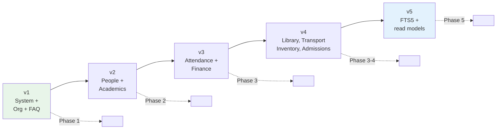

Rules — these avoid the exact bug in `faq_database.dart:68`:

1. Migration steps are **cumulative and unconditional**: `for (var v = from; v < to; v++) applyStep(v)`. Never `if (oldVersion < N)` with a hardcoded `N`.
2. Every version gets a committed schema snapshot; drift's schema tests assert a fresh `v5` create matches a `v1 → v5` migration exactly.
3. Additive only — new tables and nullable columns. Never rename or drop in place; migrate data into a new table and drop the old one in a later version.
4. A migration failure must **not** leave a half-migrated DB. Wrap in a transaction; on failure, drop the file and force a full cold sync — the server is the source of truth, so this is always safe.
5. Bumping the version to refresh **content** (the FAQ scenario) requires an explicit reseed step in that version, not a silent no-op.

### 5.19 Indexing rule

> An index is usable only if its **leading columns** match the query's `WHERE` equality predicates, followed by the `ORDER BY` columns — and never with a leading `LIKE '%…'`.

`idx_faqs_target_roles` violates this today — fixed in §5.14. Every index above must be justified by an `EXPLAIN QUERY PLAN` showing `SEARCH`, not `SCAN`, asserted in a test:

```dart
test('roster query uses idx_students_roster', () async {
  final plan = await db.customSelect(
    'EXPLAIN QUERY PLAN SELECT * FROM students '
    'WHERE class_id = ? AND section_id = ? ORDER BY roll_number',
    variables: [Variable('C-5'), Variable('S-5A')],
  ).get();
  expect(plan.first.data['detail'], contains('USING INDEX idx_students_roster'));
});
```

### 5.20 Hot query reference

| Screen | Query | Index used |
|---|---|---|
| Class roster | `WHERE class_id=? AND section_id=? ORDER BY roll_number` | `idx_students_roster` |
| Roll call today | `WHERE section_id=? AND date=?` | `idx_att_section_date` |
| Student attendance history | `WHERE student_id=? ORDER BY date DESC LIMIT 50` | `idx_att_student_date` |
| Fee ledger | `WHERE student_id=? ORDER BY due_date` | `idx_ledger_student` |
| Report card | `WHERE student_id=? AND exam_id=?` | `idx_marks_student_exam` |
| Notice board | `WHERE status='published' ORDER BY is_pinned DESC, published_at DESC` | `idx_ann_feed` |
| Teacher timetable | `WHERE staff_id=? AND day_of_week=? ORDER BY period_no` | `idx_tt_staff_day` |
| Overdue books | `WHERE status='issued' AND due_at < ?` | `idx_issues_open` |
| Unified search | `search_index MATCH ?` | FTS5 |
| Any dashboard | `WHERE role=? AND scope_id=?` | PK |
| Outbox drain | `WHERE status='pending' AND next_attempt_at <= ?` | `idx_outbox_ready` |

---

## 6. Sync Engine — Pull

### 6.1 Trigger flow

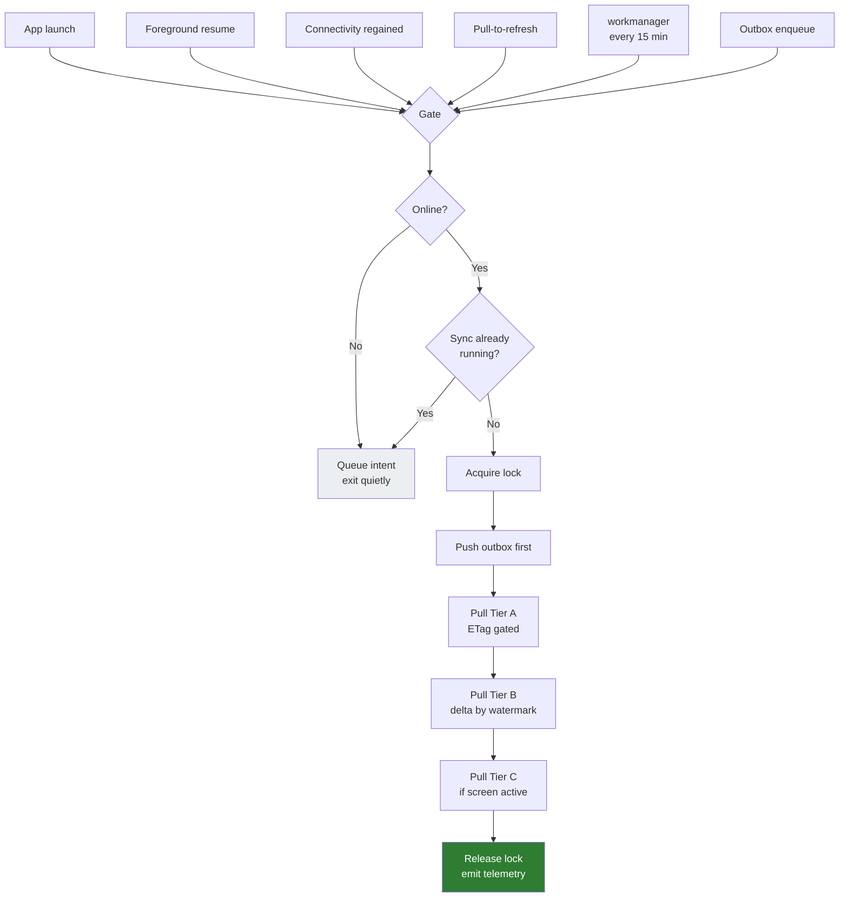

**Push before pull** — so a local edit is never overwritten by a stale server row it hasn't seen yet.

### 6.2 Delta pull sequence

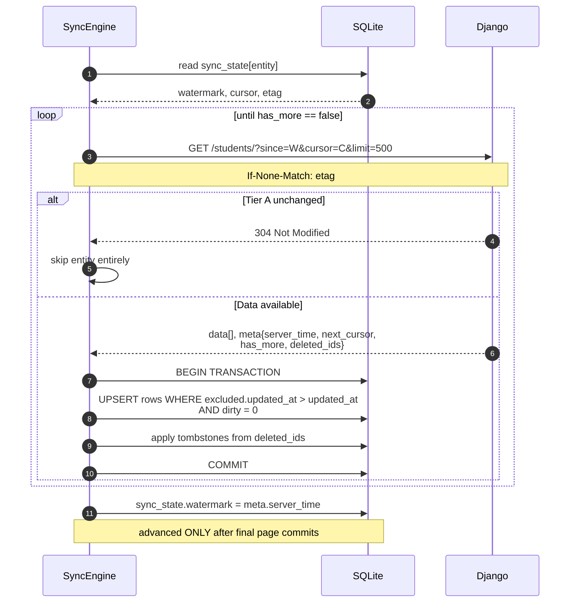

### 6.3 Two rules that prevent entire bug classes

**Tombstones are mandatory.** Without `deleted_ids`, a student who transfers out **stays in every device's cache forever**. This is the most commonly skipped part of delta sync and the most damaging.

**Always use server time, never device time.** Watermarks come from `meta.server_time`, never `DateTime.now()`. A phone with a clock 3 minutes fast will permanently skip a window of records — silent, near-undebuggable data loss.

### 6.4 Conflict-safe upsert

```sql
INSERT INTO students (...) VALUES (...)
ON CONFLICT(server_id) DO UPDATE SET ...
WHERE excluded.updated_at > students.updated_at   -- never clobber newer with older
  AND students.dirty = 0;                          -- never clobber a pending local edit
```

---

## 7. Sync Engine — Push (Outbox)

Applies to: roll call, marks entry, leave approve/reject, announcement drafts, admissions enquiries, inventory adjustments.

### 7.1 Offline write sequence

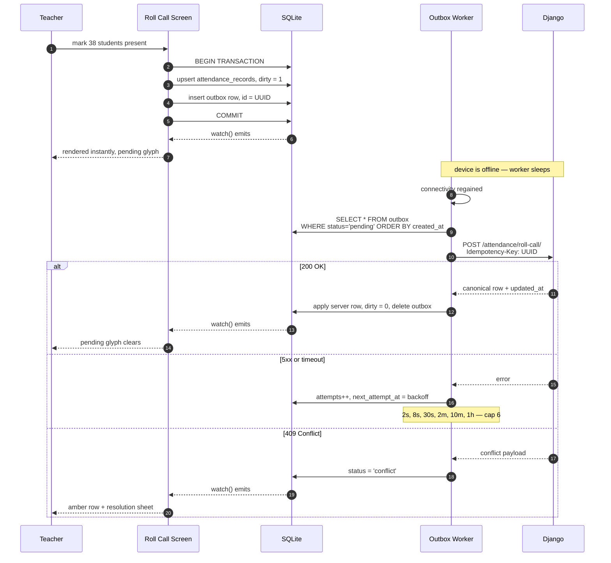

### 7.2 Outbox state machine

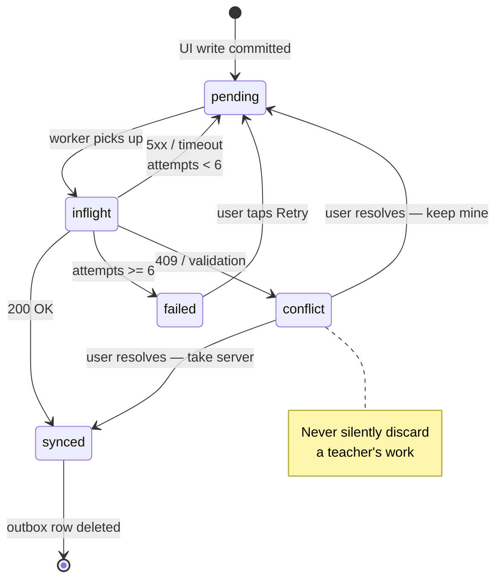

**Idempotency is non-negotiable.** Every request carries `Idempotency-Key: <outbox.id>`. A retry after a timeout can then never double-post a fee receipt or duplicate an attendance record.

### 7.3 Conflict policy — decide now, not later

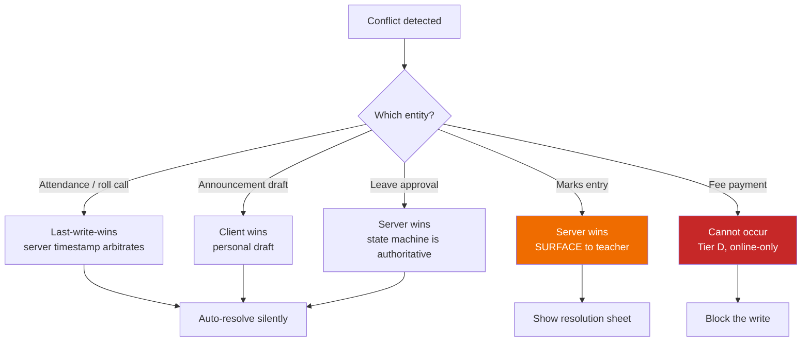

---

## 8. Performance Engineering

### 8.1 Threading

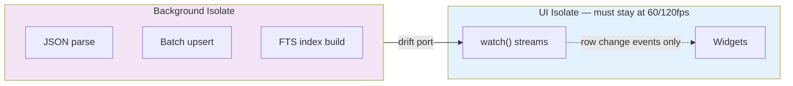

Target: **zero dropped frames during a full delta sync.**

### 8.2 Query rules

- **Keyset pagination, never `OFFSET`.** `WHERE (date, server_id) < (?, ?) ORDER BY date DESC LIMIT 50` is O(log n); `OFFSET 10000` is O(n) and degrades visibly on the 1,240-student ledger.
- Batch all inserts in one transaction — 10–100× faster than per-row.
- `EXPLAIN QUERY PLAN` assertions in tests for the top ~15 queries.

### 8.3 FTS5 — unified search becomes instant and actually works

`unified_search_screen.dart:200` currently searches a **static in-memory list** behind an `isTest` guard.

```sql
CREATE VIRTUAL TABLE search_index USING fts5(
  entity_type UNINDEXED, entity_id UNINDEXED, title, subtitle, body,
  tokenize = 'unicode61 remove_diacritics 2'
);
```

Populated by triggers on write across students, staff, classes, notices, FAQs. Result: sub-10ms cross-entity search, fully offline, with prefix matching. One of the highest-visibility UX wins in the plan.

### 8.4 Other

- **Images:** never blobs. Files on disk, `photo_path` in the row, LRU evict at ~200 MB.
- **Maintenance:** `PRAGMA optimize` on background; `wal_checkpoint(TRUNCATE)` when WAL > 16 MB; `ANALYZE` weekly; `VACUUM` only on explicit "free up space".

### 8.5 Performance budget — the definition of "fastest"

| Metric | Target |
|---|---|
| Cold start → first meaningful paint | **< 1000 ms** |
| Warm screen open, cached | **< 100 ms**, zero spinner |
| Local list query, 10k rows paginated | **< 16 ms** |
| FTS search keystroke → results | **< 50 ms** |
| Delta sync on 4G | **< 3 s** |
| Scroll jank, p99 frame time | **< 16 ms** |
| Offline read coverage, Tier A+B | **100%** |

Measure against a seeded 10k-row DB — `TEST_ACCOUNTS_SEED_10K.md` already describes the dataset.

---

## 9. Security & Multi-User Correctness

### 9.1 Per-user encrypted database lifecycle

School devices are shared — staff-room tablets, front desk. One DB across logins = cross-user data leak.

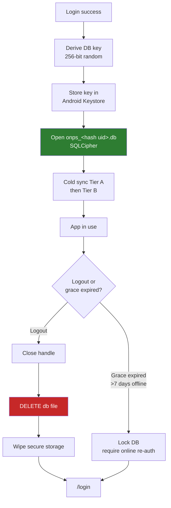

**Isolation is physical, not filtered** — there is no `user_id` predicate to forget.

### 9.2 Offline authorization

With no backend to enforce roles, the client must:

- Persist role + permissions **from server-issued JWT claims**, never a client-settable field
- Add a **role guard to `router.dart`** — fixes **B5**
- **Delete `switchRole()`** from production — fixes **B4**. Genuine multi-role staff needs real re-authentication returning a new JWT
- Only cache rows the server actually returned for *that* user

---

## 10. Backend Contract (Django) — the critical dependency

**None of §6 or §7 is possible without these.** Without `updated_at` and tombstones, "delta sync" degrades into full refetch — strictly worse than today. The Django source is not in this repo; treat this as the contract to hand over.

### 10.1 Required response envelope

```jsonc
{
  "data": [ /* rows */ ],
  "meta": {
    "server_time": "2026-09-24T10:05:31Z",   // watermark source — required on EVERY response
    "next_cursor": "eyJ1cGRhdGVkX2F0Ijoi...", // keyset, not page numbers
    "has_more": true,
    "deleted_ids": ["STU-114", "STU-980"]     // tombstones — mandatory
  }
}
```

Today responses are inconsistent — sometimes `data`, sometimes raw, sometimes `data.roster` (`student_api_service.dart:48-52`). Every client parser is bespoke because of this. Fix it once.

### 10.2 Checklist

**Model layer**
- [ ] `updated_at = DateTimeField(auto_now=True, db_index=True)` on every syncable model
- [ ] `deleted_at` soft-delete + default manager excluding it; hard-delete forbidden
- [ ] Composite index `(school_id, updated_at, id)` on every syncable table

**API layer**
- [ ] `?since=<ISO8601>` on every list endpoint
- [ ] **Keyset cursor** pagination — `?page=` (used today) drifts and duplicates rows mid-sync
- [ ] Uniform envelope per §10.1
- [ ] `ETag` + `If-None-Match` → `304` on all Tier A endpoints
- [ ] `Idempotency-Key` header + dedupe table, 24h retention
- [ ] `POST /api/v1/sync/batch` — drain outbox in one round trip
- [ ] `GET /api/v1/sync/manifest` — per-entity version stamps so the client skips untouched entities
- [ ] `POST /api/v1/auth/refresh/` — required for offline grace periods
- [ ] gzip/brotli; `?fields=` sparse fieldsets

**Correctness**
- [ ] Object-level permission checks on every sync endpoint — `?since=` must never widen a user's visible row set
- [ ] Rate-limit sync endpoints per device

---

## 11. Execution Roadmap

Strangler pattern — the old path keeps working until each slice is replaced. No big-bang rewrite of 56 screens.

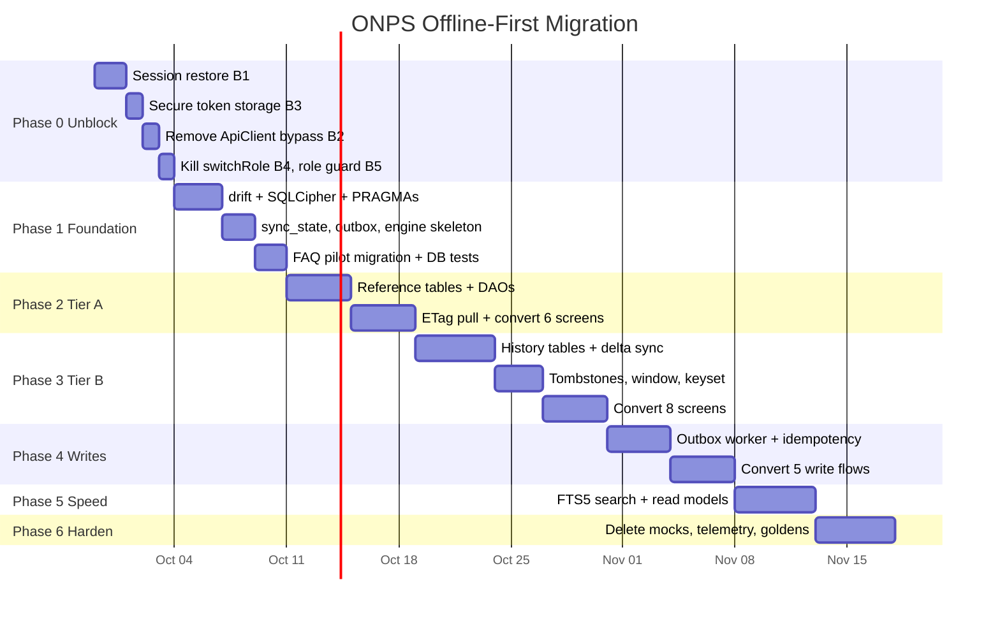

### Phase gates

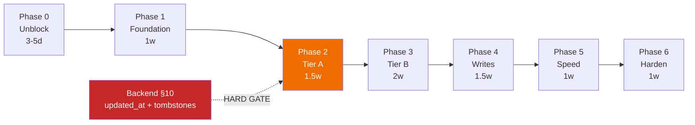

### Exit criteria per phase

| Phase | Exit criterion |
|---|---|
| **0** | App cold-starts into a restored session **offline**; tests can exercise the network path |
| **1** | FAQ screen reads from drift via `watch()`; DB layer has real tests for the first time |
| **2** | Timetable, staff, class-info screens open instantly and work fully offline — **first phase the user can feel** |
| **3** | Student directory + attendance render from cache; delta payloads measured < 50 KB |
| **4** | Full roll call in airplane mode syncs on reconnect; forced double-submit provably does not duplicate |
| **5** | Every §8.5 budget met against the 10k seed |
| **6** | `grep -r "contains('Test')" lib/` returns **0**; `mock_data.dart` deleted |

---

## 12. UI/UX Rules

Architecture is only half of perceived speed. These are part of the deliverable.

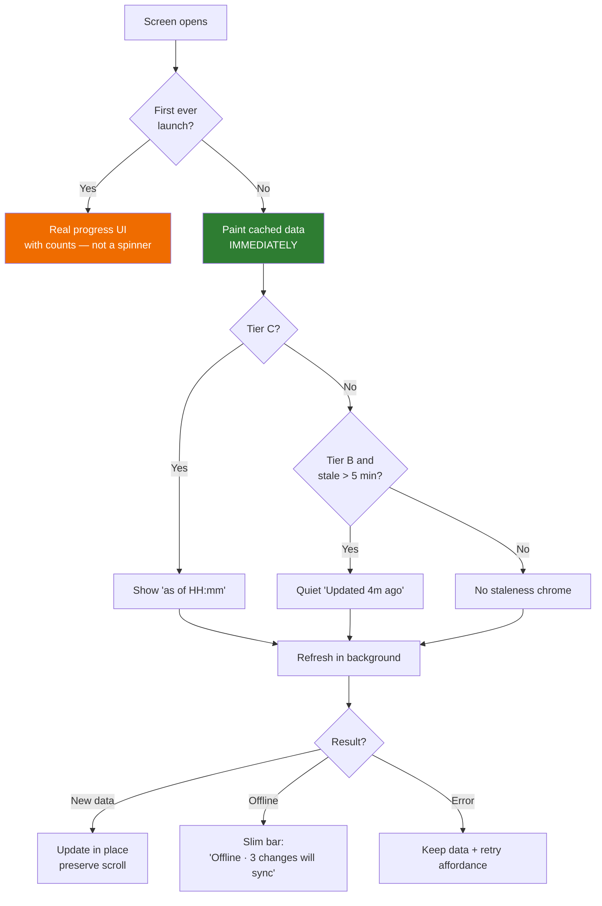

1. **Delete the spinner.** Permitted only on genuine first-ever cold sync — and then as real progress with counts.
2. **Staleness is visible, never blocking.** Tier C numbers *must* carry `as of HH:mm` — an untimestamped ₹8.4 Cr figure is a reporting hazard.
3. **Offline is a state, not an error.** Slim persistent bar, tappable to a queue sheet. Never a full-screen dead end.
4. **Optimistic writes with honest status.** Pending glyph → clears on success → amber and actionable on failure. A teacher's work is never silently lost.
5. **Empty ≠ error.** `faq_screen.dart:147-151` currently swallows every exception and renders an empty list — indistinguishable from "no results". Three distinct states required: *empty*, *error + retry*, *offline + stale copy*.
6. **Preserve scroll position and filters** — trivial once state lives in SQLite, and a large part of "feels fast".
7. **Prefetch on intent** — warm the next screen's query on tap-down.
8. **Extend the Espresso Heritage system** with tokens for `stale`, `pending`, `failed`, `conflict`, `offline`.
9. **Design for 300 kbps / 400ms RTT**, not office Wi-Fi. Many parents are on 2G/3G.

---

## 13. Risks

| Risk | Impact | Mitigation |
|---|---|---|
| Backend §10 work doesn't land | **Fatal** — full refetch is worse than today | Hard-gate Phase 2. Confirm ownership before starting |
| Migration stalls with two architectures live | Permanent 60% state | Strict strangler order; a screen is "done" only when its legacy API path is **deleted** |
| Cache/server divergence | Users act on wrong data | Server `updated_at` always wins; never advance watermark on partial sync; telemetry |
| Shared-device data leak | Serious privacy incident | Per-user encrypted DB file, deleted on logout — §9.1 |
| Local DB growth on low-end devices | Storage pressure | Rolling window + LRU + photos on disk + user-visible usage |
| Drift learning curve | Slower first 2 weeks | Phase 1 pilots on the smallest table (FAQ) before real entities |

---

## 14. Definition of Done

- [ ] Every §8.5 budget met on a mid-range device against the 10k seed
- [ ] Airplane mode: every Tier A and Tier B screen renders real data
- [ ] Full offline roll call syncs correctly on reconnect; double-submit provably does not duplicate
- [ ] `grep -r "contains('Test')" lib/` returns **0**
- [ ] `lib/data/mock/mock_data.dart` deleted
- [ ] DB layer test coverage > 80%, including migration and conflict tests
- [ ] Logout provably leaves zero readable user data on device
- [ ] Sync telemetry live: duration, payload size, failure rate, outbox depth, conflict count

---

## 15. Open Decisions

| # | Decision | Blocks | Default if unanswered |
|---|---|---|---|
| 1 | Can the Django backend be changed? (§10) | Phase 2 onward | Plan is not viable — stop at Phase 1 |
| 2 | Approve `sqflite` → `drift` migration? (§3.1) | Phase 1 | Proceed with drift |
| 3 | Continue paused physical-device QA first? | Sequencing | No — Tier A/B screens are about to be rewritten |
