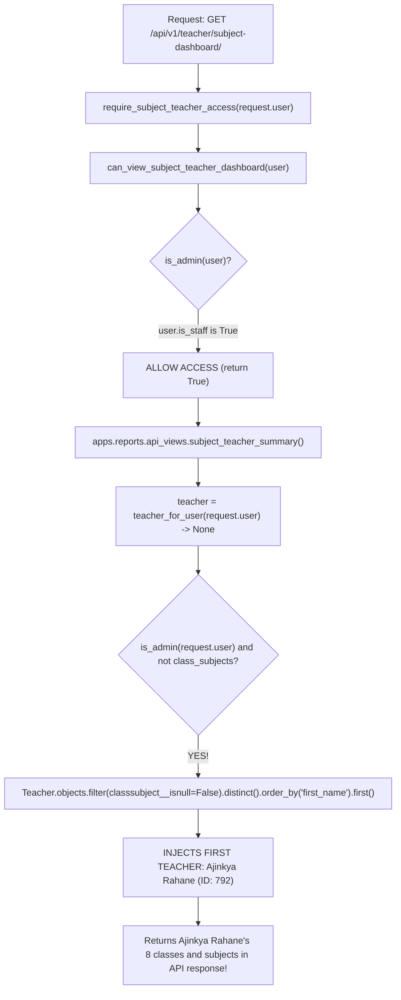
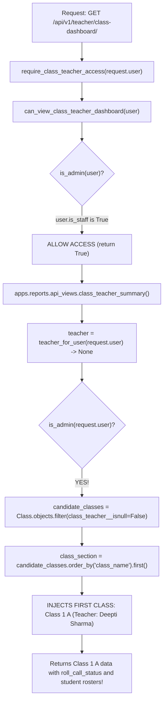

# Role Identity Root Cause Analysis: Principal / Class Teacher / Subject Teacher

**Date**: 2026-09-26  
**Status**: INVESTIGATION COMPLETE (NO FIXES APPLIED)  
**Target Repository**: `sms-android-app-alpha` (`/Users/onenuman/Documents/GitHub/sms-android-app-alpha`)  
**Backend Repository**: `sms` (`/Users/onenuman/Documents/sms`)  
**Authoritative Database**: MySQL `onenuma1_school` on `localhost:3306`

---

## 1. Reported Issue

1. `principal.numan` appears as a **Subject Teacher** with assigned classes and subjects.
2. Principal information is incorrect in some screens (e.g. appearing with role `STAFF` instead of `PRINCIPAL` in Profile, or showing faculty assignments).
3. Class Teacher information is incorrect in some screens (e.g. `principal.numan` appearing as Class Teacher of `Class 1 A`).

---

## 2. Environment

- **Backend Framework**: Django 5.x / Django REST Framework
- **Backend Root**: `/Users/onenuman/Documents/sms`
- **Django Settings**: `config.settings`
- **Python Virtualenv**: `/Users/onenuman/Documents/sms/.venv`
- **Database Engine**: `django.db.backends.mysql`
- **Database Name**: `onenuma1_school`
- **Database User**: `onenuma1_school@localhost`
- **MySQL Version**: 9.6.0
- **Flutter Target**: `/Users/onenuman/Documents/GitHub/sms-android-app-alpha` (package `sms_android_app_alpha`)

---

## 3. Authoritative Database Connection

The connection was verified via live Django ORM cursor query:
```sql
SELECT VERSION(), DATABASE(), USER();
```
**Output**: `MySQL 9.6.0`, `onenuma1_school`, `onenuma1_school@localhost`.

---

## 4. `principal.numan` Database Identity

Direct database query on `auth.User`, reverse foreign keys, and all related tables:

- **Primary Key (`auth_user.id`)**: `38290`
- **Username**: `principal.numan`
- **Email**: `principal.numan@school.example`
- **is_active**: `True`
- **is_staff**: `True` (created in `seed_10k.py:409`)
- **is_superuser**: `False`
- **Groups**: `['Principal']`
- **Direct Permissions**: `0`
- **Linked Profile Records**:
  - `apps.staff.models.Staff`: **id=13** (OneToOne: `user_id=38290`)
    - `first_name`: `Mohd`
    - `surname`: `Numan`
    - `designation`: `Principal` (`Staff.Designation.PRINCIPAL`)
    - `mobile_number`: `9999900001`
    - `email_address`: `principal.numan@school.example`
  - `apps.teachers.models.Teacher`: **DOES NOT EXIST** (`Teacher.objects.filter(user=u).count() == 0`)
  - `apps.students.models.Student`: **DOES NOT EXIST**
  - `apps.parents.models.Parent`: **DOES NOT EXIST**

---

## 5. Critical Questions Verification

### Critical Question #1: Does `principal.numan` actually have a Teacher record?
**NO.**
- `Teacher.objects.filter(user__username='principal.numan').exists()` → **False**
- `Teacher.objects.filter(email_address='principal.numan@school.example').exists()` → **False**
- Total Teachers in system: **255**. Every single teacher is linked to an ordinary teacher user account (e.g. `washingtonsundar`, `ajinkyarahane`, etc.). None are linked to `principal.numan`.

### Critical Question #2: Does `principal.numan` actually have a Subject Teacher assignment?
**NO.**
- `ClassSubject.objects.filter(teacher__user__username='principal.numan').count()` → **0**
- `ClassSubject.objects.filter(teacher__email_address='principal.numan@school.example').count()` → **0**
- `principal.numan` teaches **0** subjects in the database.

### Critical Question #3: Does `principal.numan` have a Class Teacher assignment?
**NO.**
- `Class.objects.filter(class_teacher__user__username='principal.numan').count()` → **0**
- `Class.objects.filter(class_teacher__email_address='principal.numan@school.example').count()` → **0**
- `principal.numan` is homeroom teacher of **0** classes in the database.

### Critical Question #4: Find the Principal/Leadership record.
**YES.**
- Model: `apps.staff.models.Staff`
- Primary Key: `13`
- Linked User: `principal.numan` (`user_id=38290`)
- Designation: `Principal`
- Group: `Principal`
- Active: `True`

---

## 6. Role Matrix for `principal.numan`

| Identity Source | Actual Database Value | Notes |
|---|---|---|
| `auth_user.is_staff` | `True` | Set by `seed_10k.py:409` |
| `auth_user.is_superuser` | `False` | Ordinary staff account |
| `auth.Group` | `['Principal']` | Added via `Staff.save()` |
| `Staff` profile | `id=13, designation='Principal'` | Sole domain identity in backend |
| `Teacher` record | **NONE** | Does not exist |
| `ClassSubject` assignment | **NONE** | 0 records |
| `Class.class_teacher` | **NONE** | 0 records |
| `Timetable` assignments | **NONE** | 0 records |
| `apps.accounts.services.profile_for_user()` | `role='staff', designation='Principal'` | Evaluates `Staff` record |
| `GET /api/v1/account/profile/` | `{'role': 'staff', 'designation': 'Principal'}` | Returns literal string `'staff'` |
| `apps.reports.registry.dashboards_for()` | `['principal', 'class_teacher', 'subject_teacher', 'accountant', 'librarian']` | **Leak: qualifies for 5 dashboards!** |
| `apps.reports.registry.primary_dashboard()` | `'principal'` | Priority 10 |

---

## 7. Role Resolvers in the Backend

There are three primary role resolvers in the backend:

### Resolver 1: `apps.students.roles.resolve_role(user, student)`
- **File**: `/Users/onenuman/Documents/sms/apps/students/roles.py:157`
- **Purpose**: Student profile / Dossier RBAC scoped to a student.
- **Precedence**: `SUPER_ADMIN` > `SCHOOL_ADMIN` > `PRINCIPAL` > `VICE_PRINCIPAL` > `STUDENT` > `PARENT` > `CLASS_TEACHER` > `TEACHER` > `ACCOUNTANT` > `RECEPTIONIST` > `LIBRARIAN`
- **Output for `principal.numan`**: `PRINCIPAL` (since `user.groups.filter(name='Principal')` matches).

### Resolver 2: `apps.accounts.services.profile_for_user(user)`
- **File**: `/Users/onenuman/Documents/sms/apps/accounts/services.py:365`
- **Purpose**: Authenticated user's own profile and global role identity.
- **Logic**:
  ```python
  for role, lookup in (
      ('teacher', teacher_for_user), ('staff', staff_for_user),
      ('parent', parent_for_user), ('student', student_for_user),
  ):
      record = lookup(user)
      if record is not None:
          return {'role': role, 'record': record, ...}
  ```
- **Flaw**: Checks `staff_for_user` and returns generic string `'staff'` instead of distinguishing `'principal'`, `'vice_principal'`, `'accountant'`, `'librarian'`, `'receptionist'`.

### Resolver 3: `apps.reports.registry.dashboards_for(user)`
- **File**: `/Users/onenuman/Documents/sms/apps/reports/registry.py:111`
- **Purpose**: Determines which Daily Operating Center dashboards a user can reach.
- **Logic**: Evaluates `dashboard.is_visible_to(user)` using each dashboard's permission function.
- **Flaw**: Both `_class_teacher` and `_subject_teacher` permissions contain `if is_admin(user): return True`. Because `principal.numan` has `is_staff=True`, he passes `is_admin(user)` and qualifies for both dashboards!

---

## 8. Role Precedence Analysis

In `apps.reports.registry.DASHBOARDS`:
```python
DASHBOARDS = (
    Dashboard('principal', ..., priority=10),
    Dashboard('class_teacher', ..., priority=20),
    Dashboard('subject_teacher', ..., priority=30),
    Dashboard('accountant', ..., priority=40),
    Dashboard('librarian', ..., priority=50),
    Dashboard('parent', ..., priority=60),
    Dashboard('student', ..., priority=70),
)
```
- When `primary_dashboard(principal_user)` is called, it correctly returns `'principal'` because `priority=10` is lowest.
- However, `dashboards_for(principal_user)` returns **all five dashboards** because `is_admin(principal_user)` is `True`.

---

## 9. Subject Teacher Resolution Trace (The "Ajinkya Rahane" Injection)

When `GET /api/v1/teacher/subject-dashboard/` is called with `principal.numan`'s JWT:



**Exact Code in `apps/reports/api_views.py:187-192`**:
```python
    teacher = teacher_for_user(request.user)
    class_subjects = list(class_subjects_taught_by(teacher)) if teacher is not None else []
    if is_admin(request.user) and not class_subjects:
        from apps.teachers.models import Teacher

        teacher = Teacher.objects.filter(classsubject__isnull=False).distinct().order_by('first_name').first()
        class_subjects = list(class_subjects_taught_by(teacher)) if teacher is not None else []
    require(class_subjects, "You don't teach any subject.")
```
**Finding**: The backend intentionally fabricated Subject Teacher data for admin users! Because `principal.numan` is an admin (`is_staff=True`), the backend assigned him the first teacher in alphabetical order (`Ajinkya Rahane`), complete with 8 assigned classes and subjects!

---

## 10. Class Teacher Resolution Trace (The "Class 1 A" Injection)

When `GET /api/v1/teacher/class-dashboard/` is called with `principal.numan`'s JWT:



**Exact Code in `apps/reports/api_views.py:132-141`**:
```python
    teacher = teacher_for_user(request.user)
    candidate_classes = classes_taught_by(teacher) if teacher is not None else Class.objects.none()
    if is_admin(request.user):
        candidate_classes = Class.objects.filter(class_teacher__isnull=False)

    class_id = request.query_params.get('class_id')
    class_section = candidate_classes.filter(pk=class_id).first() if class_id else None
    if class_section is None:
        class_section = candidate_classes.order_by('class_name').first()
```
**Finding**: The backend intentionally defaulted admin users to the first class in the entire school (`Class 1 A`), presenting Deepti Sharma's classroom as the Principal's classroom!

---

## 11. Role Switcher & Frontend Flow

In the Flutter app (`sms-android-app-alpha`):

1. **Login Screen Default Role Tab**:
   - `lib/screens/auth/login_screen.dart:32`: `UserRole _selectedRole = UserRole.classTeacher;`
   - When the user launches the app, the **Teacher tab is selected by default**.
   - If the user enters `principal.numan` without tapping "Staff", Flutter sends the credentials, logs in, and immediately routes to `/teacher/class-dashboard`.
   - The backend then serves `Class 1 A` to the Principal.

2. **RoleSwitcherSheet**:
   - `lib/widgets/role_switcher_sheet.dart:92-101`:
   - Hardcodes all 10 roles in the sheet without consulting backend permissions or `dashboards_for(user)`.
   - Tapping "Subject Teacher Desk" switches `AuthState.currentRole` to `UserRole.subjectTeacher` and navigates to `/teacher/subject-dashboard`.
   - The Subject Teacher screen greets `Mohd Numan` and displays `Ajinkya Rahane`'s teaching load.

3. **Account Profile Display Bug**:
   - In `lib/screens/account/account_profile_screen.dart:102-104`:
     ```dart
     final role = (userProfile?['role'] as String?)?.trim().isNotEmpty == true
         ? (userProfile!['role'] as String).toUpperCase()
         : AuthState.roleTitle(auth.currentRole).toUpperCase();
     ```
   - Because `GET /api/v1/account/profile/` returns `'role': 'staff'`, the screen displays **`STAFF`** instead of **`PRINCIPAL`**.

---

## 12. Control Persona Comparison

| Dimension | 1. Genuine Principal (`principal.numan`) | 2. Genuine Class Teacher (`washingtonsundar`) | 3. Genuine Subject Teacher (`ajinkyarahane`) |
|---|---|---|---|
| `auth_user.is_staff` | `True` | `False` | `False` |
| `auth.Group` | `['Principal']` | `[]` | `[]` |
| `Staff` profile | `Staff(id=13, desig='Principal')` | `None` | `None` |
| `Teacher` record | **NONE** | `Teacher(id=766)` | `Teacher(id=792)` |
| `Class.class_teacher` | **0 classes** | `Class('Nursery A')` | `Class('LKG J')` |
| `ClassSubject` count | **0 subjects** | **8 subjects** | **8 subjects** |
| `profile_for_user()` | `{'role': 'staff', 'designation': 'Principal'}` | `{'role': 'teacher'}` | `{'role': 'teacher'}` |
| `can_view_principal_dashboard` | `True` | `False` | `False` |
| `can_view_class_teacher_dashboard` | `True` (**BUG via `is_admin`**) | `True` (via `classes_taught_by`) | `True` (via `classes_taught_by`) |
| `can_view_subject_teacher_dashboard` | `True` (**BUG via `is_admin`**) | `True` (via `class_subjects_taught_by`) | `True` (via `class_subjects_taught_by`) |
| Backend Subject Dashboard Payload | Injects `Ajinkya Rahane` | Returns Washington Sundar | Returns Ajinkya Rahane |
| Backend Class Dashboard Payload | Injects `Class 1 A` | Returns Nursery A | Returns LKG J |

---

## 13. Exact Root Cause Breakdown

### Root Cause 1: Backend Admin Fallback in Dashboard API Views (CONFIRMED)
- **Location**: `apps/reports/api_views.py:187-192` (`subject_teacher_summary`) and `apps/reports/api_views.py:134-141` (`class_teacher_summary`)
- **Mechanism**: The backend explicitly checks `if is_admin(request.user) and not class_subjects:`, and if true, queries the database for the *first available teacher/class* and returns that data in the API payload.
- **Impact**: Any administrative user (including `principal.numan` who has `is_staff=True`) querying the subject teacher endpoint gets assigned `Ajinkya Rahane`'s identity and workload, and on the class teacher endpoint gets assigned `Class 1 A`.

### Root Cause 2: Backend Permission Over-Granting in Dashboard Registry (CONFIRMED)
- **Location**: `apps/reports/permissions.py:14-15` & `27-28`
- **Mechanism**:
  ```python
  def can_view_class_teacher_dashboard(user):
      if is_admin(user): return True
  def can_view_subject_teacher_dashboard(user):
      if is_admin(user): return True
  ```
- **Impact**: In the web UI and wherever `dashboards_for(user)` is queried, `principal.numan` is declared to be eligible for both the Class Teacher Dashboard and Subject Teacher Dashboard, despite holding zero academic assignments.

### Root Cause 3: Backend Profile API Returns Generic `'staff'` Role (CONFIRMED)
- **Location**: `apps/accounts/services.py:381-392` (`profile_for_user`)
- **Mechanism**: Loops over `('teacher', 'staff', 'parent', 'student')` and hardcodes `'role': 'staff'` when matching `Staff`. It does not extract the granular role from `Staff.designation` or `auth.Group`.
- **Impact**: Mobile profile screens display the coarse string `STAFF` instead of `PRINCIPAL`.

### Root Cause 4: Flutter Role Switcher & Login Tab Decoupling (CONFIRMED)
- **Location**: `lib/widgets/role_switcher_sheet.dart` & `lib/screens/auth/login_screen.dart`
- **Mechanism**:
  - `RoleSwitcherSheet` displays all 10 roles unconditionally and permits any authenticated session to switch to any dashboard.
  - `login_screen.dart` defaults to the `Teacher` tab (`UserRole.classTeacher`). If a Principal enters credentials without switching tabs, Flutter navigates them to the Class Teacher Dashboard.
- **Impact**: Triggers Root Causes #1 and #2.

---

## 14. Recommended Fix Locations (FOR REVIEW ONLY — NO FIXES APPLIED)

1. **`apps/reports/api_views.py`**:
   - In `subject_teacher_summary`: Remove the `if is_admin(request.user) and not class_subjects:` fallback that injects the first teacher. If the caller is not a teacher of any subjects, return `403 Forbidden` or `{ 'assigned_classes': [], 'total_classes': 0 }` with message `"You do not have any teaching assignments."`.
   - In `class_teacher_summary`: Remove the `candidate_classes = Class.objects.filter(class_teacher__isnull=False)` fallback. If the caller is not assigned as a Class Teacher, return `403 Forbidden` or an empty state.

2. **`apps/reports/permissions.py`**:
   - Restrict `can_view_class_teacher_dashboard` and `can_view_subject_teacher_dashboard` so that administrators without actual teaching assignments do not qualify for teacher dashboards (or only have picker access in web templates without falsely claiming the teacher identity).

3. **`apps/accounts/services.py`**:
   - In `profile_for_user(user)`: If `record` is a `Staff` instance, resolve `role` to `record.designation.lower().replace(' ', '_')` (e.g. `'principal'`) rather than generic `'staff'`.

4. **`lib/widgets/role_switcher_sheet.dart` & `lib/screens/auth/login_screen.dart`**:
   - Gate available roles in `RoleSwitcherSheet` to match the user's actual institutional persona or backend-reported available dashboards.
   - On login, auto-resolve destination route from the backend profile rather than blindly relying on the pre-selected login tab.

---

## 15. Fix Status

- **Code modified**: **NO**
- **Database modified**: **NO**
- **Flutter modified**: **NO**
- **Remote push**: **NO**
